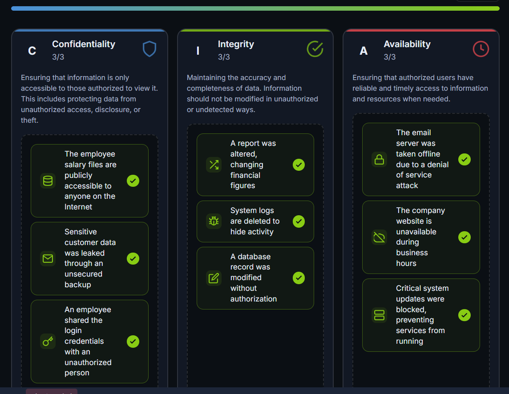
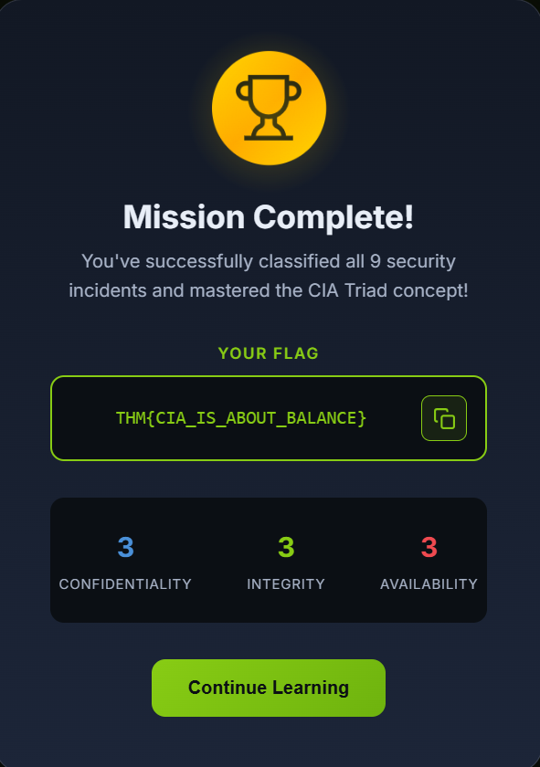

# CIA Triad – TryHackMe Write-up

## Room Information

- **Platform:** TryHackMe  
- **Module:** Cyber Security Fundamentals  
- **Room Name:** CIA Triad  
- **Difficulty:** Beginner  
- **Status:** ✅ Completed  

---

# Objective

Learn about:

- The three pillars of cybersecurity
- Confidentiality, Integrity, and Availability
- Why the CIA Triad is important
- How cybersecurity professionals think during incidents
- Real-world examples of security problems

---

# Task 1: Introduction

## 🔹 Concept

Cybersecurity protects digital information and systems from attacks.

Modern information is stored digitally, including:

- Personal files
- Bank records
- Company data
- Government information

Without security:

- Data can be stolen
- Data can be modified
- Services can stop working

---

## 🔹 Learning Objectives

Understand:

- Confidentiality
- Integrity
- Availability
- The CIA Triad mindset

---

## ✅ Answer

**No answer required**

---

# Task 2: Understanding the CIA Triad

## 🔹 What is the CIA Triad?

The CIA Triad is the foundation of cybersecurity.

It contains three important security principles:

| CIA Pillar | Purpose |
|---|---|
| Confidentiality | Protect data from unauthorized access |
| Integrity | Protect data from unauthorized modification |
| Availability | Keep systems and data accessible |

---

# Confidentiality

## 🔹 Meaning

Confidentiality ensures that only authorized people can access sensitive data.

---

## 🔹 Real-Life Example

Talking privately with a friend while preventing strangers from listening.

---

## 🔹 Digital Example

Someone steals your login credentials on public Wi-Fi.

---

## 🔹 Protection Methods

- Passwords
- Encryption
- Access controls
- Authentication

---

## Examples

| Situation | Confidentiality Achieved? |
|---|---|
| Gmail password written on sticky note | No |
| Company documents only accessible to employees | Yes |
| Personal documents leaked online | No |

---

## ✅ Answer

**Question:** Which CIA pillar prevents unauthorized access to data?  
**Answer:** Confidentiality

---

# Integrity

## 🔹 Meaning

Integrity ensures data cannot be modified without permission.

---

## 🔹 Real-Life Example

Someone changes your exam grades before submission.

---

## 🔹 Digital Example

An attacker changes bank transfer details during a transaction.

---

## 🔹 Protection Methods

- Hashing
- Verification
- Digital signatures
- Access restrictions

---

## Examples

| Situation | Integrity Achieved? |
|---|---|
| Data changed with approval | Yes |
| Attendance records modified secretly | No |
| Product price changed before checkout | No |

---

## ✅ Answers

**Question:** Which CIA pillar prevents unauthorized modification of data?  
**Answer:** Integrity

**Question:** Which CIA pillar is affected when data becomes untrustworthy?  
**Answer:** Integrity

---

# Availability

## 🔹 Meaning

Availability ensures systems and data are accessible when needed.

---

## 🔹 Real-Life Example

A bank system stops working because of a power failure.

---

## 🔹 Digital Example

A website crashes because attackers send too many requests.

---

## 🔹 Protection Methods

- Backup systems
- Redundancy
- Load balancing
- Power generators

---

## Examples

| Situation | Availability Achieved? |
|---|---|
| Critical services stop after software install | No |
| Company website offline during work hours | No |
| Systems accessible to employees | Yes |

---

## ✅ Answer

**Question:** Which CIA pillar ensures data is available when needed?  
**Answer:** Availability

---

# CIA Triad Summary

| Pillar | Main Goal |
|---|---|
| Confidentiality | Keep data secret |
| Integrity | Keep data accurate |
| Availability | Keep systems running |

---

## ✅ Answer

**Question:** What is the term used collectively for these pillars?  
**Answer:** CIA Triad

---

# Task 3: The Security Mindset

## 🔹 Cybersecurity Mindset

The CIA Triad is not just theory.

Cybersecurity professionals use it as a way of thinking during incidents.

---

## 🔹 Questions Security Professionals Ask

### Confidentiality
- Was sensitive data exposed?

### Integrity
- Was data modified without permission?

### Availability
- Were systems unavailable to users?

---

# Hands-on Exercise

## 🔹 Activity

Solved an interactive exercise by matching security incidents with the correct CIA pillar.

---



## ✅ Flag



```text
THM{CIA_IS_ABOUT_BALANCE}
```
---

## ✅ Answer

Question: CIA Triad is what type of mindset?
Answer:```text
Security mindset

---

# Task 4: Conclusion

## 🔹 What I Learned
* What cybersecurity protects
* The three pillars of security
* Real-world examples of CIA Triad
* How security professionals think
* Importance of balancing all three pillars
  
## Key Terminology
### Term	Meaning
* Confidentiality ->	Protecting data from unauthorized access
* Integrity ->	Preventing unauthorized data modification
* Availability ->	Keeping systems and data accessible

---

# Skills Gained

* Understanding cybersecurity basics
* Recognizing security risks
* Identifying CIA Triad violations
* Building a cybersecurity mindset

---

# Real-World Relevance

Useful for:

*  Cybersecurity
*  Ethical hacking
*  SOC analysis
*  Incident response
*  Security engineering
*  Network security

---

# Challenges Faced

* Understanding the difference between confidentiality and integrity
* Identifying which CIA pillar was affected in scenarios
* Learning how all three pillars work together

---

# Author

Achal Deshmukh
* 🎓 MCA Student
* 🔐 Cybersecurity Learner
* 💻 TryHackMe Enthusiast

---

# ⭐ Notes

The CIA Triad is the foundation of cybersecurity. Almost every cyber attack or security defense relates to one or more of these three principles. Understanding them is essential for every cybersecurity beginner.
