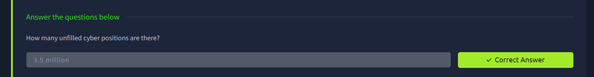
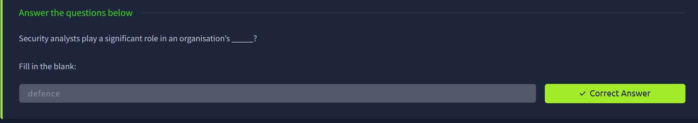
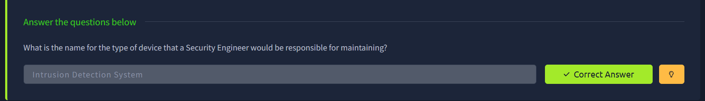
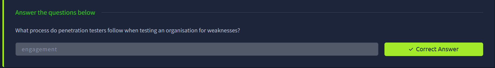

# Cyber Security Careers – TryHackMe Write-up

## Room Information

* **Platform:** TryHackMe
* **Room Name:** Cyber Security Careers
* **Difficulty:** Beginner
* **Status:** ✅ Completed

---

## Objective

Understand different career paths in cybersecurity and identify roles based on interests and skills.

---

# Task 1: Introduction to Cyber Security Careers

### 🔹 Key Points:

* Cybersecurity has many roles:

  * Offensive Security (attacking systems ethically)
  * Defensive Security (protecting systems)

* No specific background required

* High demand and good salaries

---

### 📊 Industry Insight:

* Unfilled jobs → **3.5 million**

---

### ✅ Answer:

`3.5 million`

---

# Task 2: Security Analyst

### 🔹 Role:

* Protects organisation systems (Blue Team)
* Monitors and investigates suspicious activity

---

### 🔹 Daily Work:

* Monitor logs and alerts
* Investigate unusual behavior
* Respond to incidents

---

### 🔹 Example:

* User logging in from another country → suspicious

---

### 🔹 Career Growth:

* Threat Hunting
* Incident Response
* Malware Analysis

---

### ✅ Answer:

`defence`

---

# Task 3: Security Engineer

### 🔹 Role:

* Builds and maintains security systems
* Protects infrastructure

---

### 🔹 Example Tool:

* Intrusion Detection System (IDS)

---

### 🔹 Daily Work:

* Design security systems
* Fix vulnerabilities
* Monitor latest threats

---

### 🔹 Career Growth:

* Cloud Security
* Application Security

---

### ✅ Answer:

`Intrusion Detection System`

---

# Task 4: Penetration Tester

### 🔹 Role:

* Ethical hacker (offensive security)
* Finds vulnerabilities by attacking systems safely

---

### 🔹 Process:

* Testing is done under agreement → called **engagement**

---

### 🔹 Daily Work:

* Test systems and websites
* Find vulnerabilities
* Write reports

---

### 🔹 Career Growth:

* Web Pentesting
* Network Pentesting
* Red Teaming (advanced level)

---

### ✅ Answer:

`engagement`

---

# Task 5: Career Quiz

### 🔹 Activity:

* Took interactive quiz to identify suitable role

---

### ✅ Answer:

* No answer required

---

# Final Outcome

Learned about:

* Different cybersecurity career paths
* Roles and responsibilities
* Skills required for each role

---

# Skills Gained

* Career awareness
* Understanding of cyber roles
* Direction for future learning

---

# Real-World Relevance

Helps in choosing career paths like:

* SOC Analyst
* Security Engineer
* Penetration Tester

---

# Challenges Faced

* Choosing between offensive and defensive roles

---

# 🚀 Author

**Achal Deshmukh**

* 🎓 MCA Student
* 🔐 Cybersecurity Learner

---

# ⭐ Notes

Cybersecurity offers multiple career paths. Choosing the right one depends on your interest in **building (defensive)** or **breaking (offensive)** systems.
