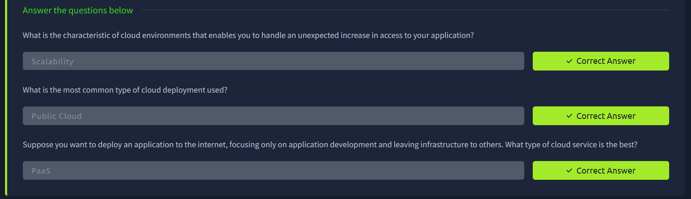
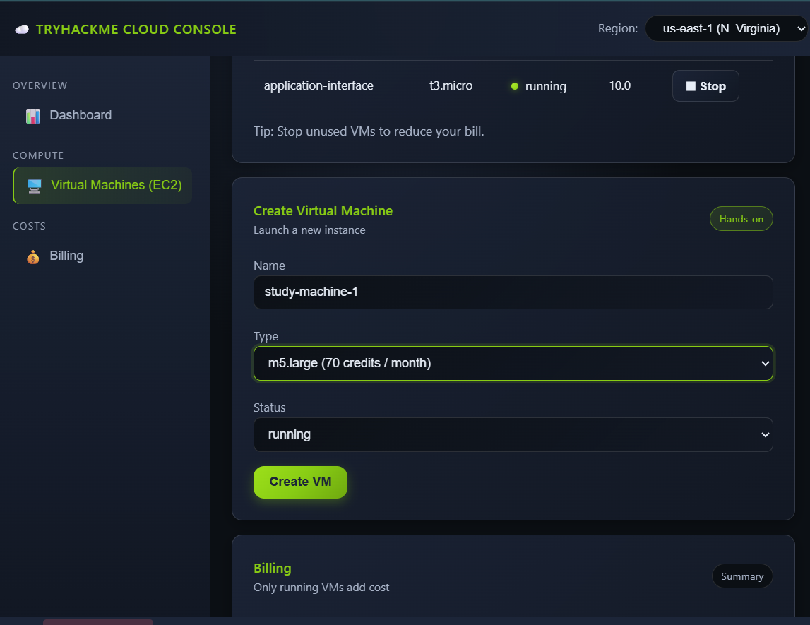
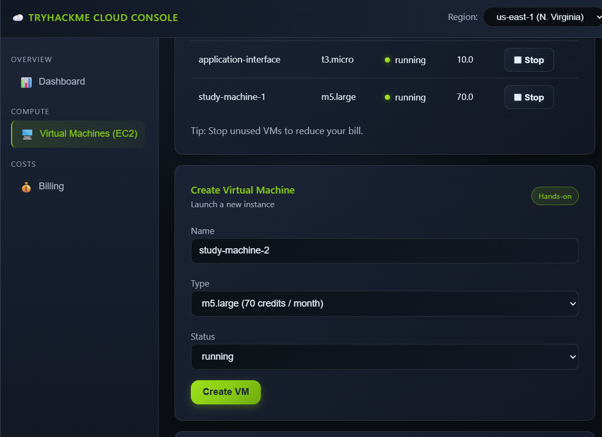
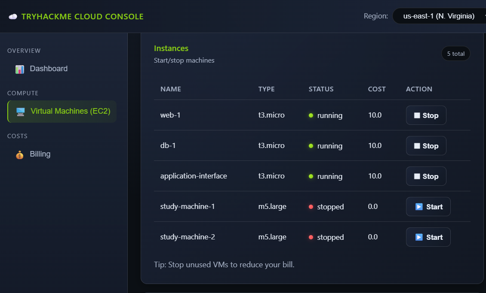
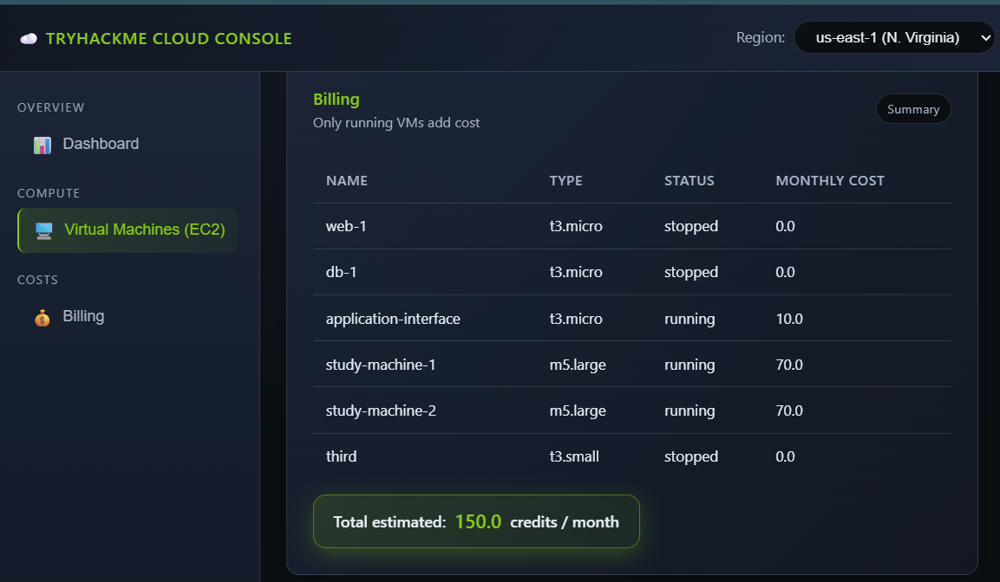
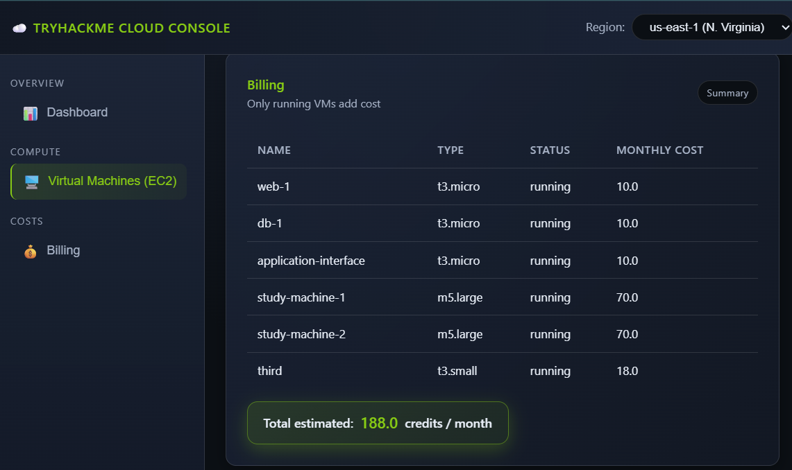

# Cloud Computing Fundamentals

## Introduction

In this room, I learned the basics of cloud computing and how companies use cloud services to build scalable, reliable, and cost-effective applications.

Cloud computing helps applications:
- Run globally
- Scale easily
- Stay online
- Reduce infrastructure costs

The cloud is built using technologies like:
- Virtualization
- Containers

These technologies allow multiple applications to run efficiently on shared infrastructure.

---

# Learning Objectives

After completing this room, I learned about:

- What cloud computing is
- Cloud service models (IaaS, PaaS, SaaS)
- Types of cloud environments
- Benefits of cloud computing
- Major cloud providers
- How companies use cloud services
- Basic AWS-style cloud deployment

---

# Task 1 — Introduction

## What I Learned

Traditional applications hosted on a single computer face many problems:

- Slow access for global users
- Hardware limitations
- Downtime if the computer turns off
- Poor scalability during high traffic

Cloud computing solves these issues by providing:
- Internet-based computing resources
- Flexible infrastructure
- Global availability

---

# Task 2 — Cloud Computing Overview

# What is Cloud Computing?

Cloud computing means using:
- Servers
- Storage
- Networking
- Applications

over the internet instead of relying on local hardware.

This allows businesses to:
- Scale faster
- Reduce costs
- Improve availability
- Manage resources easily

---

# Evolution of Servers to Cloud

Cloud computing evolved over time:

| Stage | Description |
|---|---|
| Physical Servers | One application per server |
| Virtualization | Multiple virtual machines on one server |
| Containers | Lightweight application environments |
| Cloud Computing | On-demand internet-based infrastructure |

---

# Benefits of Cloud Computing

## Scalability
Applications can increase or decrease resources depending on traffic.

Example:
```text
More users → More resources
Fewer users → Fewer resources
```

---

## On-Demand Self-Service

Resources can be created instantly without buying hardware.

---

## Pay Only for What You Use

Companies only pay for resources they consume.

---

## Security

Cloud providers implement:
- Monitoring
- Encryption
- Firewalls
- Physical security

---

## High Availability

Applications remain online even if part of the infrastructure fails.

---

## Global Access

Applications can be accessed worldwide.

---

# Types of Cloud

## Public Cloud

Infrastructure shared over the internet.

Examples:
- AWS
- Azure
- Google Cloud

### Used By
- Startups
- Websites
- Global applications

---

## Private Cloud

Cloud infrastructure dedicated to one organization.

### Used By
- Banks
- Government organizations
- Healthcare systems

---

## Hybrid Cloud

Combination of:
- Public cloud
- Private cloud

### Used By
Companies needing:
- Scalability
- Private data protection

---

# Cloud Service Models

---

# Infrastructure as a Service (IaaS)

Users manage:
- Operating system
- Applications

Provider manages:
- Hardware
- Networking
- Infrastructure

### Example
AWS EC2

---

# Platform as a Service (PaaS)

Provider manages:
- Infrastructure
- Operating system

Developers focus only on applications.

### Example
Google App Engine

---

# Software as a Service (SaaS)

Complete applications delivered through the internet.

### Examples
- Gmail
- Zoom
- Google Docs

---

# Major Cloud Providers

| Provider | Description |
|---|---|
| AWS | Largest cloud provider |
| Microsoft Azure | Popular in enterprise environments |
| Google Cloud Platform | Strong AI and analytics tools |
| Alibaba Cloud | Major provider in Asia |
| IBM Cloud | Focus on hybrid cloud |
| Oracle Cloud | Enterprise databases and applications |

---

# Real-World Cloud Usage

## Netflix
Uses AWS to:
- Stream globally
- Handle millions of users
- Maintain uptime

---

## Spotify
Uses cloud infrastructure to:
- Store music
- Scale quickly
- Deliver content globally

---

## Instagram
Uses cloud storage for:
- Photos
- Videos
- Fast global delivery

---

# Task 2 Questions & Answers



## Q1. What characteristic helps handle unexpected traffic increases?

```text
Scalability
```

---

## Q2. What is the most common cloud deployment type?

```text
Public Cloud
```

---

## Q3. Which cloud service model focuses only on application development?

```text
PaaS
```

---

# Task 3 — Deploying a Cloud Instance

In this exercise, I deployed a simulated cloud environment similar to AWS.

The goal was to understand:
- Cloud instance creation
- Resource management
- Cost optimization

---

# Basic Cloud Terminology

## EC2 Instance

EC2 is a virtual computer running in the cloud.

It includes:
- CPU
- RAM
- Storage

---

# Instance Types

Instance types define system power.

Examples:
- `t3.micro` → Small and cheap
- `m5.large` → Powerful and expensive

---

# Region Selection

A region represents a geographic location where resources are hosted.

Examples:
- Europe
- North America
- Asia

Choosing a region affects:
- Latency
- Performance
- Availability

---

# Creating Virtual Machines

## Machine 1 — Application Interface

| Setting | Value |
|---|---|
| Instance Name | application-interface |
| Instance Type | t3.micro |
| Status | running |

---

## Machine 2 — Study Machine 1

| Setting | Value |
|---|---|
| Instance Name | study-machine-1 |
| Instance Type | m5.large |
| Status | running |



---

## Machine 3 — Study Machine 2

| Setting | Value |
|---|---|
| Instance Name | study-machine-2 |
| Instance Type | m5.large |
| Status | running |



---

# Billing Analysis

Cloud platforms charge based on resource usage.

I analyzed:
- Monthly instance costs
- Total environment cost
- Cost reduction after stopping instances

---

# Cost Optimization

I stopped:
- study-machine-1
- study-machine-2



This reduced the total monthly cost significantly.

This demonstrated:
- Pay-as-you-go pricing
- Flexible cloud management
- Cost optimization

---

# Task 3 Questions & Answers

## Q1. Total cost after stopping study machines?

```text
30
```

---

## Q2. Monthly cost of m5.large instance?

```text
70
```

---

## Q3. Total cost with only new instances running?



```text
150
```

---

## Q4. Total cost after adding a third t3a.small machine?



```text
188
```

---

# Task 4 — Conclusion

# Key Concepts Learned

## Public Cloud
Shared cloud infrastructure over the internet.

---

## Private Cloud
Dedicated cloud environment for one organization.

---

## Hybrid Cloud
Combination of public and private cloud services.

---

## IaaS
Rent infrastructure resources like servers and storage.

---

## PaaS
Develop and deploy applications without managing servers.

---

## SaaS
Use software directly through the internet.

---

## EC2
Virtual machines provided by AWS.

---

# Main Benefits of Cloud Computing

- Scalability
- On-demand self-service
- Pay only for what you use
- Security
- High availability
- Global access

---

# Final Key Takeaways

- Cloud computing provides internet-based infrastructure
- Applications become more scalable and reliable
- Companies reduce hardware management costs
- Cloud providers offer flexible deployment models
- AWS is the most widely used cloud provider
- Cloud services are essential in modern IT and cybersecurity

---

# Skills Practiced

- Cloud Computing Fundamentals
- AWS Concepts
- EC2 Basics
- Cloud Deployment
- Resource Scaling
- Cost Optimization
- Infrastructure Management
- Cybersecurity Infrastructure Awareness
