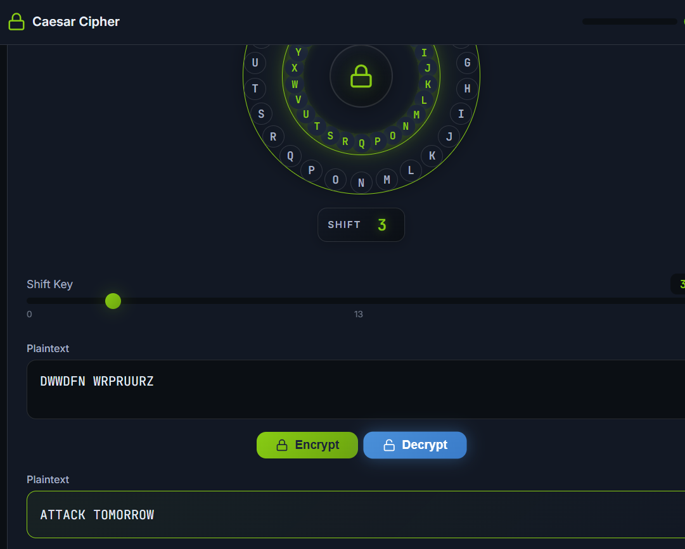
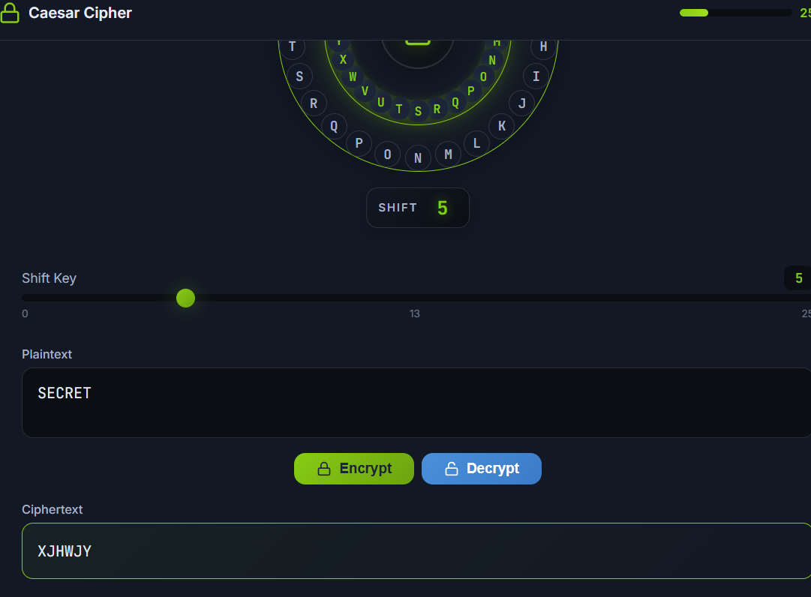
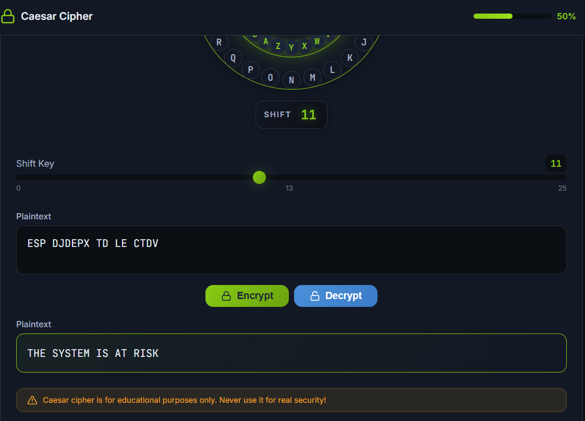
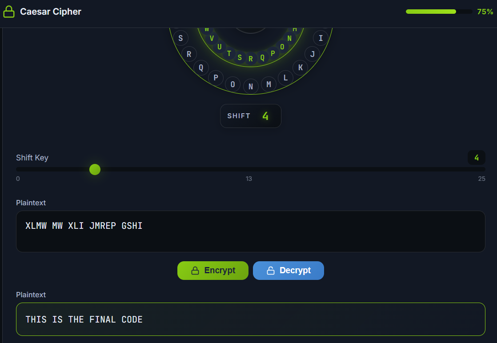
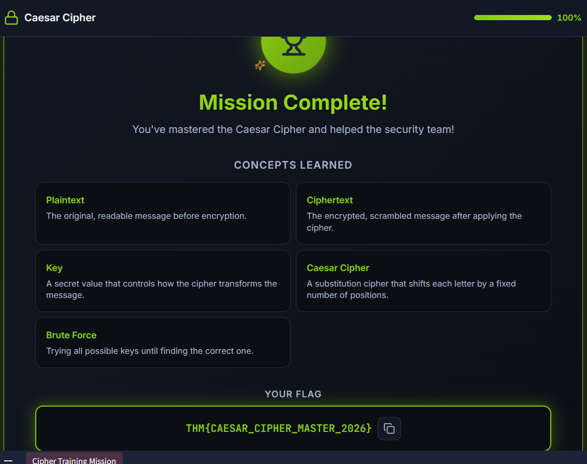

# Cryptography Concepts – TryHackMe Write-up

## Room Information

- **Platform:** TryHackMe  
- **Module:** Cyber Security Fundamentals  
- **Room Name:** Cryptography Concepts  
- **Difficulty:** Beginner  
- **Duration:** 60 Minutes  
- **Status:** ✅ Completed  

---

# Objective

Learn about:

- Basics of cryptography
- Plaintext and ciphertext
- Keys and algorithms
- Symmetric encryption
- Asymmetric encryption
- How HTTPS works
- Real-world use of encryption

---

# Task 1: Introduction

## 🔹 Opening Question

When you see the little padlock icon in your browser’s address bar, what’s actually stopping someone from reading or modifying your data as it travels across the internet?

---

# 🔹 Why Cryptography Matters

Cryptography helps protect the three pillars of cybersecurity:

| CIA Pillar | Purpose |
|---|---|
| Confidentiality | Protect data from unauthorized access |
| Integrity | Prevent unauthorized modification |
| Availability | Keep systems accessible |

Without cryptography:

- Attackers could read private data
- Information could be modified
- Sensitive communications could be intercepted

---

# 🔹 Real-World Scenario

Imagine a medical clinic sending patient records over the internet.

Without encryption:

- Hackers could read patient data
- Medical records could be changed
- Sensitive information could leak

Cryptography protects this information using:

- Mathematical rules
- Encryption algorithms
- Secret keys

---

# 🔹 Learning Objectives

By the end of this room, I learned how to:

- Explain what cryptography is
- Understand plaintext vs ciphertext
- Explain keys and algorithms
- Understand symmetric encryption
- Understand asymmetric encryption
- Explain how HTTPS protects browsing

---

# ✅ Answer

**No answer needed**

---

# Task 2: Hiding Information – Symmetric Encryption

## 🔹 Opening Question

If someone is listening to every piece of data travelling between two people, how can those people still share secrets?

---

# 🔹 Important Terms

| Term | Meaning |
|---|---|
| Plaintext | Readable message |
| Ciphertext | Scrambled unreadable message |
| Key | Secret value used for encryption/decryption |
| Algorithm | Public method used for scrambling data |

---

# 🔹 Encryption Process

```text
Plaintext + Algorithm + Key → Ciphertext
```

---

# 🔹 Decryption Process

```text
Ciphertext + Algorithm + Key → Plaintext
```

---

# Lockbox Analogy

Symmetric encryption works like a lockbox:

- The algorithm = how the lock works
- The key = secret metal key
- Plaintext = message inside the box
- Ciphertext = locked box travelling publicly

Only someone with the same key can open the box.

---

# 🔹 Plaintext vs Ciphertext

### Plaintext

```text
HELLO
```

### Ciphertext

```text
KHOOR
```

The ciphertext looks meaningless without the secret key.

---

# Caesar Cipher

The Caesar Cipher shifts letters forward by a fixed number.

## Example with Key = 3

| Plain Letter | Cipher Letter |
|---|---|
| A | D |
| B | E |
| C | F |

---

# 🔹 Encrypting HELLO

| Original | Shifted |
|---|---|
| H | K |
| E | H |
| L | O |
| L | O |
| O | R |

Encrypted result:

```text
KHOOR
```

---

# 🔹 Decrypting KHOOR

Shift letters backward by 3:

```text
K → H
H → E
O → L
O → L
R → O
```

Result:

```text
HELLO
```

---

# 🔹 Symmetric Encryption Explained

Symmetric encryption uses:

- One shared secret key
- Same key for encryption and decryption

## Advantages

- Fast
- Efficient
- Great for large amounts of data

## Problem

How do two people safely share the secret key?

This is called the:

```text
Key Distribution Problem
```

---

# Secret Message Rescue Game

Completed the Caesar Cipher challenge game by:

- Decrypting intercepted messages
- Encrypting secure messages
- Using different shift keys

---

### First Round:



### Second Round:



### Third Round:



### Fourth Round:



# ✅ Flag



```text
THM{CAESAR_CIPHER_MASTER_2026}
```

---

# ✅ Questions & Answers

## Question 1

Using the Caesar cipher with a key of 5, what does CYBER become when encoded?

### Answer

```text
HDGJW
```

---

## Question 2

Using the Caesar cipher, decode:

```text
FVZCYR PNRFNE PVCURE
```

### Answer

```text
SIMPLE CAESAR CIPHER
```

### Hint: 
```text
Shift Key is 13!
```
---

# Task 3: Sharing Keys Safely – Asymmetric Encryption

## 🔹 Opening Question

If Alice and Bob have never met and cannot safely share a key, how can they communicate securely?

---

# 🔹 The Key Distribution Problem

Symmetric encryption requires sharing the same secret key.

Problem:

- If attackers steal the key, they can decrypt everything.

Solution:

```text
Asymmetric Encryption
```

---

# 🔹 Two Keys Instead of One

Asymmetric encryption uses:

| Key Type | Purpose |
|---|---|
| Public Key | Shared openly |
| Private Key | Kept secret |

---

# Mailbox Analogy

Think of a public mailbox:

- Anyone can drop letters into it (public key)
- Only the owner can open it (private key)

---

# 🔹 How Asymmetric Encryption Works

1. Bob creates:
   - Public key
   - Private key

2. Bob shares the public key publicly.

3. Alice encrypts a message using Bob’s public key.

4. Only Bob’s private key can decrypt the message.

---

# Real-World Example – HTTPS

HTTPS uses asymmetric encryption to:

- Exchange keys securely
- Start secure communication

After the secure connection starts:

- Symmetric encryption handles the rest of the communication because it is faster.

---

# Certificates

A certificate contains:

- Website public key
- Website identity
- Signature from a trusted Certificate Authority (CA)

Browsers verify certificates before trusting websites.

---

# 🔹 Symmetric vs Asymmetric Encryption

| Feature | Symmetric | Asymmetric |
|---|---|---|
| Number of Keys | One | Two |
| Speed | Fast | Slower |
| Main Use | Bulk data encryption | Key exchange |
| Key Sharing | Difficult | Easy |
| Example | AES | RSA |

---

# ✅ Questions & Answers

## Question 1

In asymmetric encryption, which key stays secret?

### Answer

```text
private key
```

---

## Question 2

Can Alice encrypt using Bob’s public key and only Bob’s private key decrypt it?

### Answer

```text
Yay
```

---

## Question 3

What problem does asymmetric encryption solve?

### Answer

```text
key distribution
```

---

## Question 4

After HTTPS exchanges keys, which encryption handles bulk data?

### Answer

```text
symmetric
```

---

# Task 4: Conclusion

# 🔹 What I Learned

- Basics of cryptography
- Difference between plaintext and ciphertext
- Importance of keys and algorithms
- Symmetric encryption concepts
- Asymmetric encryption concepts
- HTTPS security process
- How browsers verify certificates

---

# Key Terminology

| Term | Meaning |
|---|---|
| Plaintext | Readable data |
| Ciphertext | Encrypted unreadable data |
| Key | Secret used for encryption |
| Algorithm | Encryption method |
| Symmetric Encryption | Same key for encrypt/decrypt |
| Asymmetric Encryption | Public/private key system |

---

# Skills Gained

- Understanding encryption basics
- Identifying encryption types
- Understanding HTTPS security
- Understanding key distribution
- Learning cryptography concepts

---

# Real-World Relevance

Useful for:

- Cybersecurity
- Ethical hacking
- Web security
- SOC analysis
- Secure communications
- Network security

---

# Challenges Faced

- Understanding symmetric vs asymmetric encryption
- Learning how keys work
- Understanding HTTPS handshakes
- Understanding certificates and CAs

---

# Author

**Achal Deshmukh**  
🎓 MCA Student  
🔐 Cybersecurity Learner  
💻 TryHackMe Enthusiast  

---

# ⭐ Notes

Cryptography is one of the most important foundations of cybersecurity. Every secure website, encrypted message, banking transaction, and online login relies on cryptographic principles to protect confidentiality and integrity.
