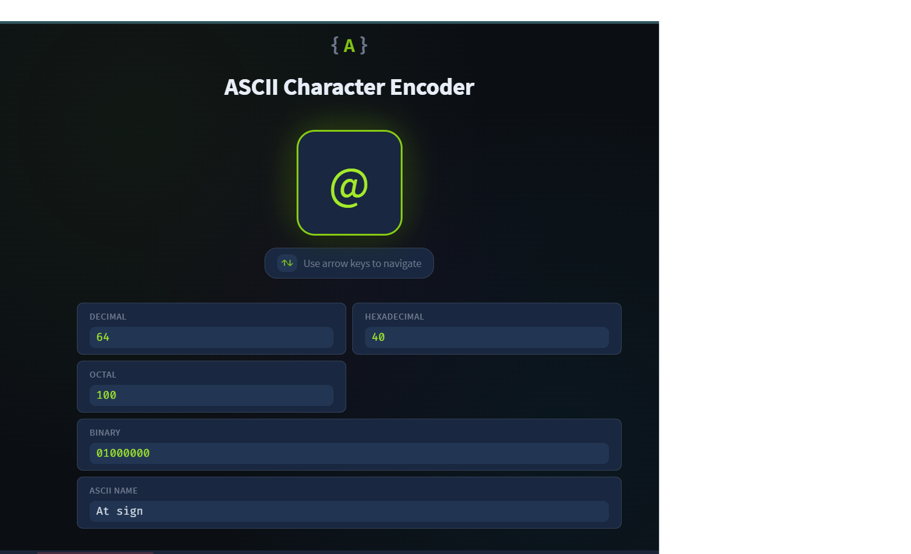
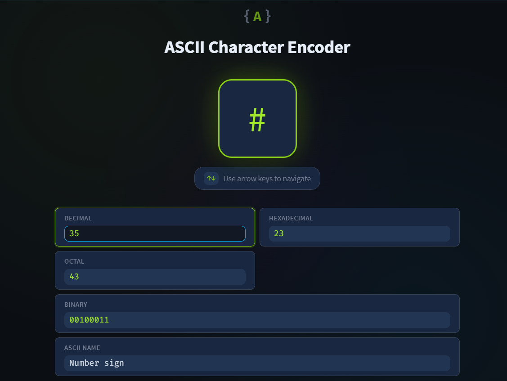
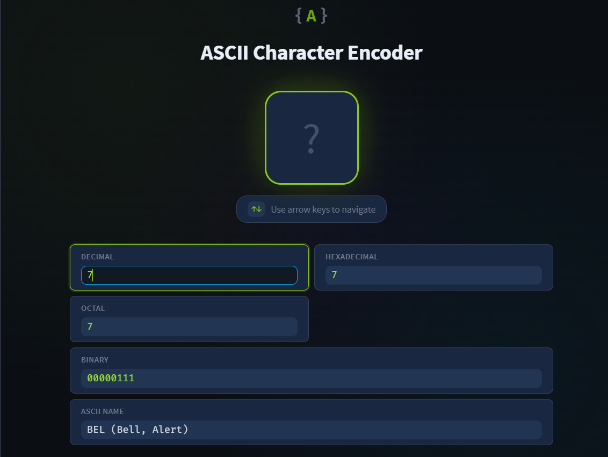
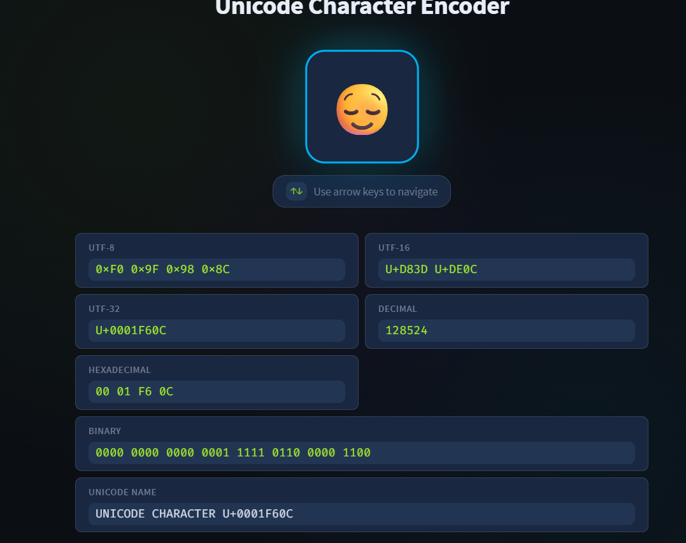
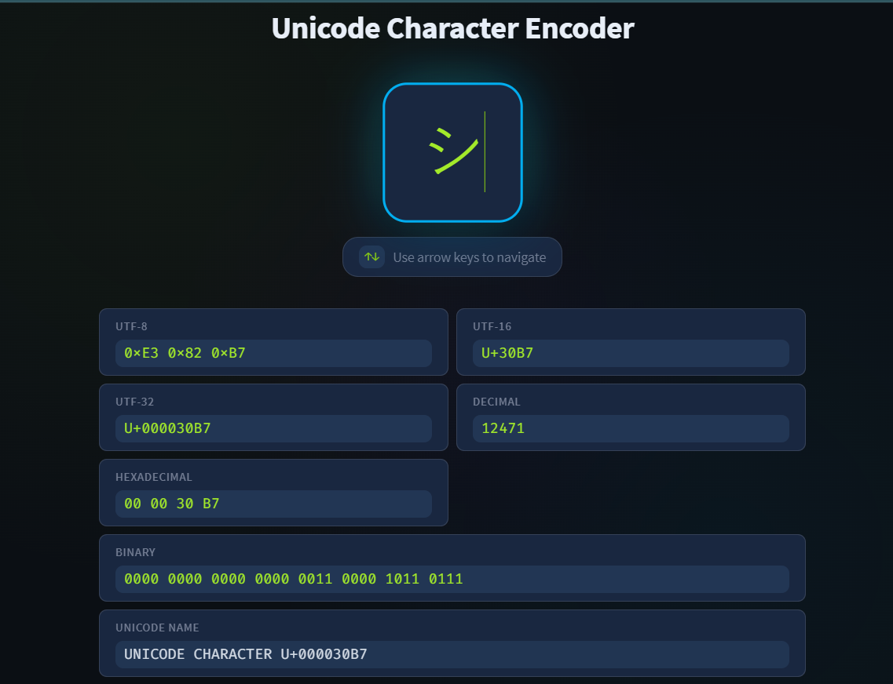
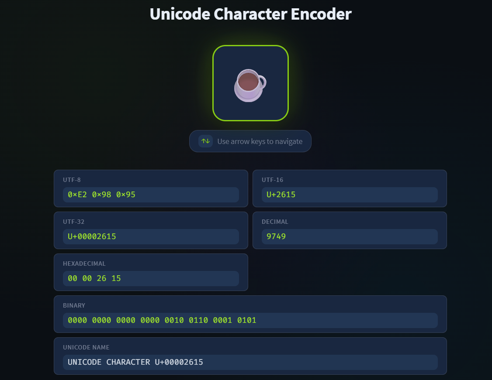
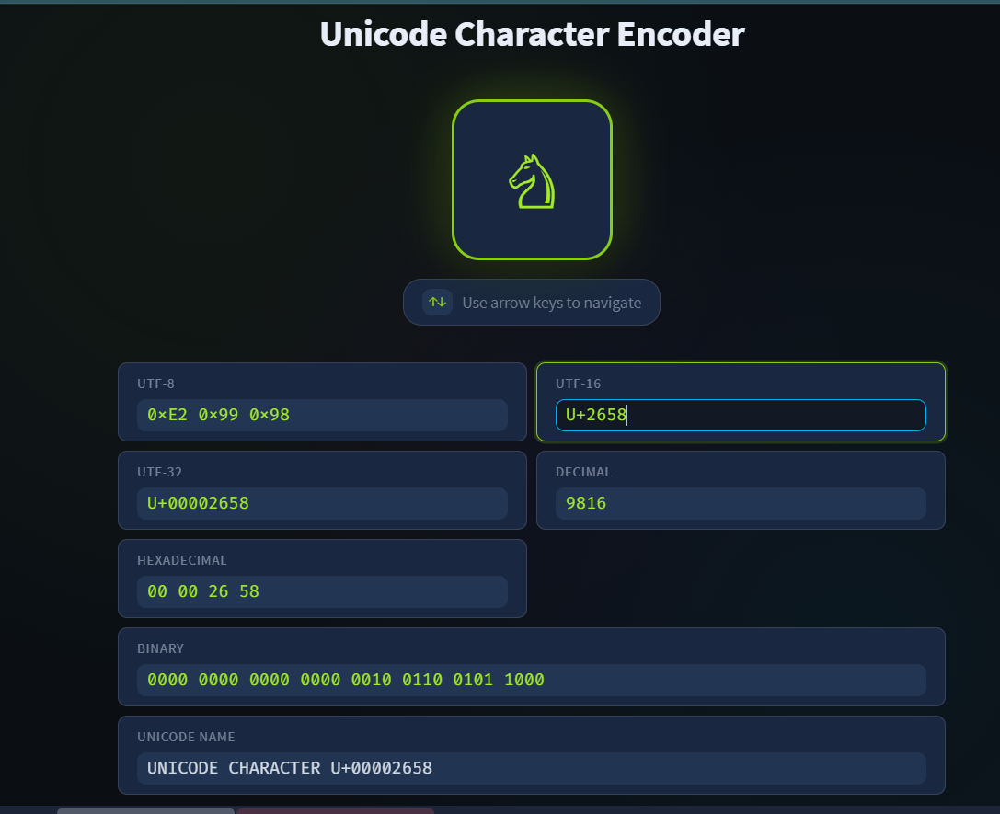

# Data Encoding

## Introduction
In this room, I learned how computers store and display text using different encoding systems. Since computers only understand binary (0s and 1s), every character such as letters, numbers, symbols, and emojis must be converted into numbers.

This process is called **encoding**.

Examples:
- `A`
- `5`
- `#`
- `😊`

All of these characters are stored as numbers inside a computer.

---

# Learning Objectives

After completing this room, I learned about:

- ASCII
- Unicode
- UTF-8
- UTF-16
- UTF-32
- Emoji encoding
- Why weird gibberish characters appear

---

# Task 1 — Introduction

## What I Learned
- Computers store everything as binary data.
- Characters are represented using numeric codes.
- Different encoding systems define how characters map to numbers.
- Wrong encoding can display unreadable or strange characters.

### Example
If a file is saved using one encoding and opened using another encoding, the text may appear corrupted or unreadable.

This happens because the computer interprets the stored numbers differently.

---

# Task 2 — ASCII

## What is ASCII?

ASCII stands for:

```text
American Standard Code for Information Interchange
```

It is one of the earliest text encoding standards created in 1963.

ASCII uses:
- 7 bits
- Values from `0–127`

It represents:
- English letters
- Numbers
- Symbols
- Control characters

---

# ASCII Examples

| Character | Decimal | Hexadecimal | Binary |
|---|---|---|---|
| A | 65 | 41 | 01000001 |
| a | 97 | 61 | 01100001 |
| 0 | 48 | 30 | 00110000 |
| # | 35 | 23 | 00100011 |

---

# Important Observation

ASCII characters follow an ordered pattern.

Examples:
- `A-Z` are stored sequentially
- `a-z` are stored sequentially
- `0-9` are stored sequentially

This makes character processing easier for computers.

---

# “TryHackMe” in ASCII

The word:

```text
TryHackMe
```

is stored as binary:

```text
01010100 01110010 01111001 01001000 01100001 01100011 01101011 01001101 01100101
```

In hexadecimal:

```text
54 72 79 48 61 63 6B 4D 65
```

---

# European Language Problem

ASCII only supports English characters.

It cannot properly represent:
- ñ
- ü
- ł
- č
- ș

To solve this, extended standards like:
- ISO-8859-1
- ISO-8859-2

were introduced.

However, different systems still caused compatibility problems.

Example:
A file saved with one encoding might display wrong characters when opened using another encoding.

---

# Task 2 Questions & Answers

## Q1. What is the ASCII code in decimal for the character @?



```text
64
```

---

## Q2. What is the character that has the ASCII code of 35 in decimal?



```text
#
```

---

## Q3. What is the name of the character that has the ASCII code of 7?



```text
BEL
```

---

# Key Takeaways from ASCII

- ASCII is an early text encoding system
- It uses 7 bits
- Supports only English characters
- Characters are stored as numbers
- Limited support caused problems for global languages

---

# Task 3 — Unicode

## Why Unicode Was Created

ASCII and extended ASCII could not support all world languages.

Problems included:
- Different systems using different encodings
- Characters displaying incorrectly
- Lack of emoji support
- No universal standard

Unicode solved these problems.

---

# What is Unicode?

Unicode is a universal character encoding standard.

It assigns a unique code point to every character from every language.

Examples:

| Character | Unicode |
|---|---|
| A | U+0041 |
| Ω | U+03A9 |
| あ | U+3042 |
| 😊 | U+1F60A |

---

# Unicode Features

Unicode supports:
- English
- Arabic
- Japanese
- Chinese
- Emojis
- Symbols
- Historical scripts

This allows text from multiple languages to exist in the same file.

---

# UTF-8, UTF-16, UTF-32

Unicode uses different encoding formats.

---

## UTF-8

UTF-8 is the most commonly used encoding on the modern web.

### Features
- Uses 1–4 bytes
- ASCII characters use 1 byte
- Emoji use 4 bytes
- Efficient and space-saving

### Example
```text
A → 1 byte
🔥 → 4 bytes
```

---

## UTF-16

UTF-16 uses:
- 2 bytes
- Sometimes 4 bytes for complex characters

### Example
```text
A → U+0041
🔥 → U+D83D U+DD25
```

---

## UTF-32

UTF-32 always uses:
- 4 bytes per character

### Example
```text
A → U+00000041
🔥 → U+0001F525
```

It is simple but uses more storage space.

---

# Unicode Character Examples

| Character | Meaning | Unicode |
|---|---|---|
| 龍 | Dragon | U+9F8D |
| 😊 | Smiley Face | U+1F60A |
| ツ | Japanese Character | U+30C4 |
| ت | Arabic Letter | U+062A |
| ♞ | Black Knight Chess Piece | U+265E |

---

# Task 3 Questions & Answers

## Q1. What is the UTF-32 encoding of 😌?



```text
U+0001F60C
```

---

## Q2. What is the UTF-16 encoding of シ?



```text
U+30B7
```

---

## Q3. What is the character with UTF-16 encoding U+2615?



```text
☕
```

---

## Q4. What is the character with UTF-16 encoding U+2658?



```text
♘
```

---

# Task 4 — Conclusion

## What I Learned

In this room, I learned:
- How text is represented in computers
- The basics of ASCII encoding
- Limitations of ASCII
- Why Unicode was created
- Differences between UTF-8, UTF-16, and UTF-32
- How emojis and symbols are encoded

---

# Final Key Takeaways

- Computers store characters as numbers
- Encoding defines how characters map to numbers
- ASCII supports only basic English characters
- Unicode supports almost every language and emoji
- UTF-8 is the most commonly used modern encoding
- Wrong encoding causes unreadable or corrupted text

---

# Skills Practiced

- Data Representation
- Character Encoding
- ASCII
- Unicode
- UTF Standards
- Binary & Hexadecimal Understanding
- Cybersecurity Fundamentals

