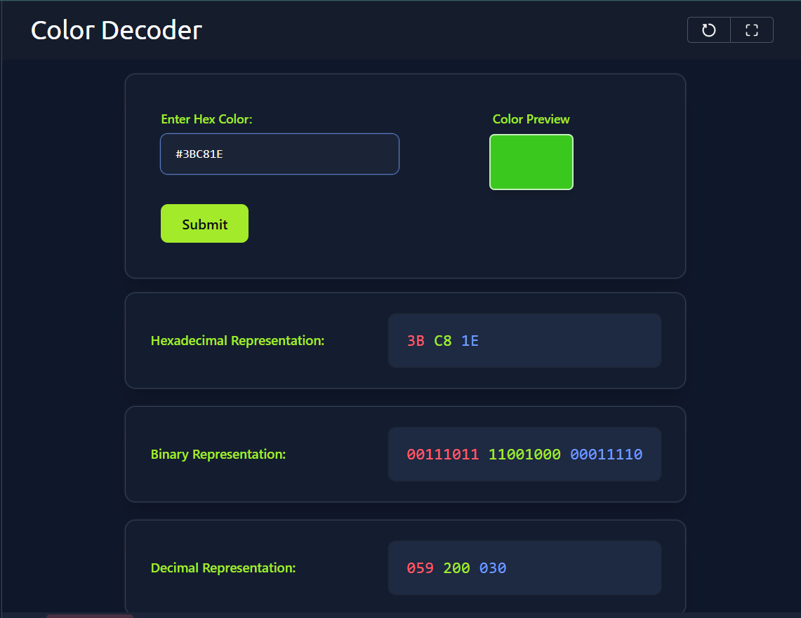
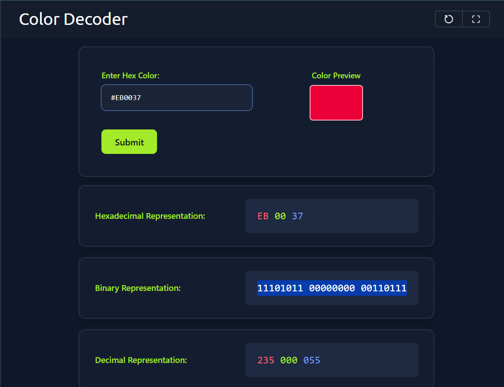
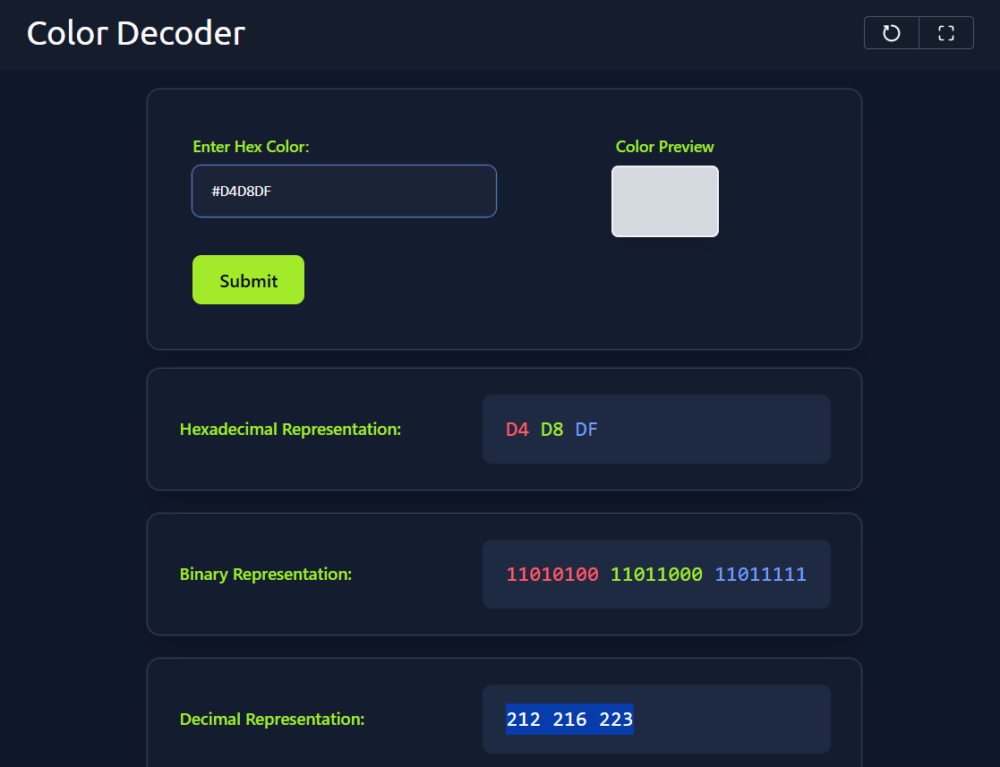
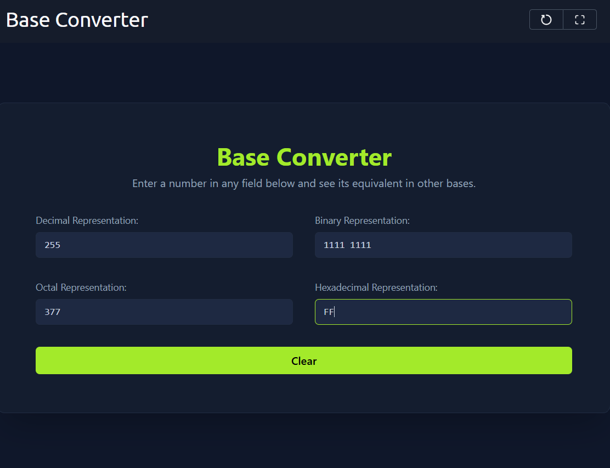
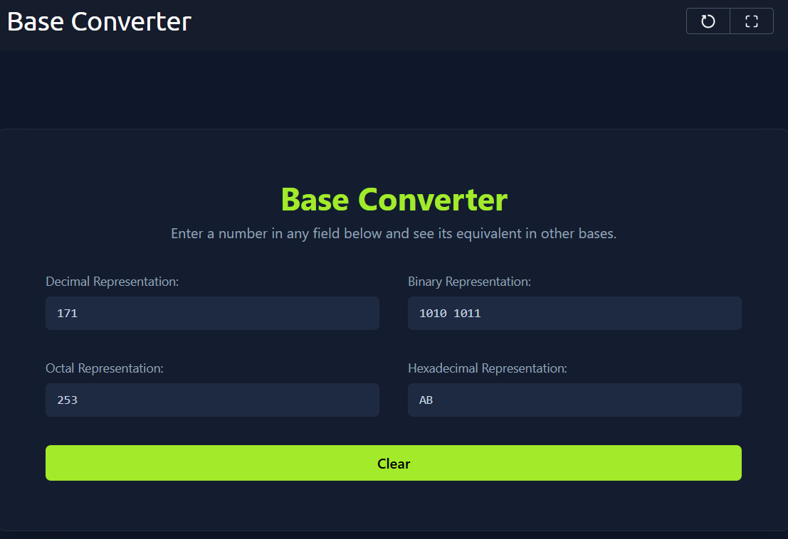
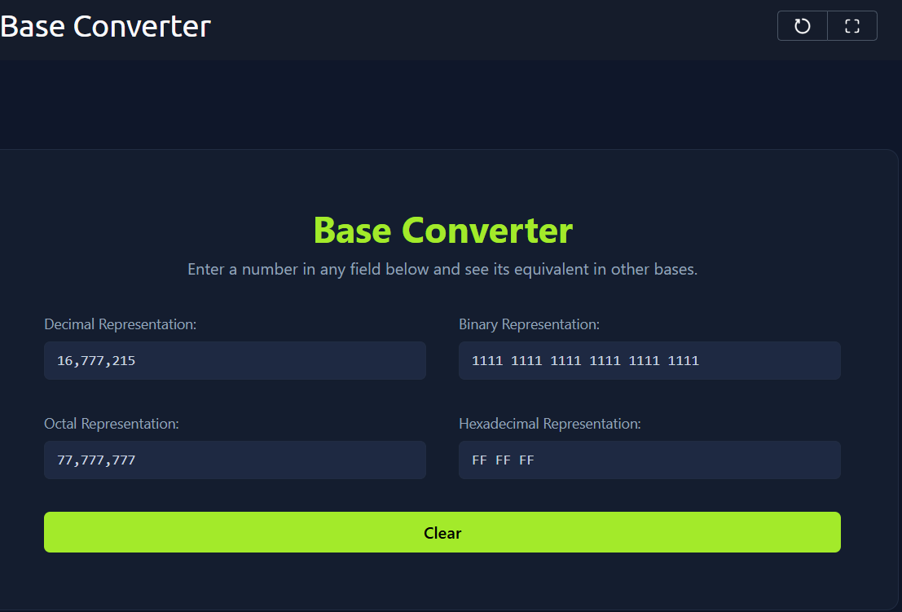

# Data Representation 1 — TryHackMe Write-up

## Room Overview
This room explains how computers represent:
- Colors using binary and hexadecimal values
- Numbers using binary, decimal, hexadecimal, and octal systems
- Data using bits and bytes

It builds foundational knowledge required in cybersecurity, networking, programming, and low-level computing.

---

# Task 1 — Introduction

## Key Concepts
Humans use the **Decimal System (Base-10)**:
- Digits: `0-9`

Computers use the **Binary System (Base-2)**:
- Digits: `0` and `1`

Computers store and process everything using only two states:
- ON / OFF
- HIGH / LOW
- TRUE / FALSE

---

## Learning Objectives
After completing this room, you should understand:
- Binary numbers
- Hexadecimal numbers
- Color representation in computers
- Bits and bytes
- Optional octal system basics

---

# Task 2 — Representing Colors

## RGB Color Model
Computers create colors using:
- Red
- Green
- Blue

This is called the **RGB model**.

Each color channel can have different intensity values.

---

# First 8 Colors

If each RGB channel has only:
- ON (`1`)
- OFF (`0`)

Then total colors:

```text
2 × 2 × 2 = 8 colors
```

---

## Binary Color Table

| Binary | Meaning | Color |
|---|---|---|
| 000 | All OFF | Black |
| 001 | Blue ON | Blue |
| 010 | Green ON | Green |
| 100 | Red ON | Red |
| 011 | Green + Blue | Cyan |
| 101 | Red + Blue | Magenta |
| 110 | Red + Green | Yellow |
| 111 | All ON | White |

---

# Bits and Bytes

## Bit
A single binary digit:
```text
0 or 1
```

## Byte
```text
8 bits = 1 byte
```

Also called:
```text
Octet
```

---

# From 8 Colors to 16 Million Colors

Modern systems use:
- 8 bits for Red
- 8 bits for Green
- 8 bits for Blue

Total:
```text
24 bits = 3 bytes
```

Each byte:
```text
2^8 = 256 values
```

Total possible colors:
```text
256 × 256 × 256 = 16,777,216 colors
```

---

# Hexadecimal Representation

Hexadecimal makes binary easier to read.

## Hex Digits

| Hex | Binary |
|---|---|
| 0 | 0000 |
| 1 | 0001 |
| 2 | 0010 |
| 3 | 0011 |
| 4 | 0100 |
| 5 | 0101 |
| 6 | 0110 |
| 7 | 0111 |
| 8 | 1000 |
| 9 | 1001 |
| A | 1010 |
| B | 1011 |
| C | 1100 |
| D | 1101 |
| E | 1110 |
| F | 1111 |

---

# Example Color Conversion

Binary:
```text
10100011 11101010 00101010
```

Hex:
```text
A3EA2A
```

---

# Important Notes

## Color Storage
A color uses:
```text
24 bits = 3 bytes
```

## RGB Structure
```text
RR GG BB
```

Example:
```text
#FF0000 = Red
#00FF00 = Green
#0000FF = Blue
```

---

# Questions & Answers

## Q1. Preview the color `#3BC81E`



### Answer:
```text
green
```

---

## Q2. Binary representation of `#EB0037`



### Answer:
```text
11101011 00000000 00110111
```

---

## Q3. Decimal representation of `#D4D8DF`



### Answer:
```text
212 216 223
```

---

# Task 3 — Numbers: Decimal to Hexadecimal

## Decimal System (Base-10)

Uses digits:
```text
0-9
```

Example:
```text
213
```

Expanded form:
```text
2×10² + 1×10¹ + 3×10⁰
```

---

# Binary Numbers (Base-2)

Uses digits:
```text
0 and 1
```

Example:
```text
1001
```

Expanded:
```text
1×2³ + 0×2² + 0×2¹ + 1×2⁰
```

Calculation:
```text
8 + 0 + 0 + 1 = 9
```

---

# Binary to Decimal Examples

| Binary | Decimal |
|---|---|
| 0000 | 0 |
| 0001 | 1 |
| 0010 | 2 |
| 0011 | 3 |
| 1100 | 12 |
| 1101 | 13 |
| 1110 | 14 |
| 1111 | 15 |

---

# Hexadecimal Numbers (Base-16)

Uses:
```text
0-9 and A-F
```

Where:

| Hex | Decimal |
|---|---|
| A | 10 |
| B | 11 |
| C | 12 |
| D | 13 |
| E | 14 |
| F | 15 |

---

# Hexadecimal Example

## Convert `9BDF` to Decimal

Expanded:
```text
9×16³ + 11×16² + 13×16¹ + 15×16⁰
```

Result:
```text
39,903
```

---

# Octal Numbers (Base-8)

Uses digits:
```text
0-7
```

Groups:
```text
3 binary bits
```

---

## Octal Table

| Octal | Binary |
|---|---|
| 0 | 000 |
| 1 | 001 |
| 2 | 010 |
| 3 | 011 |
| 4 | 100 |
| 5 | 101 |
| 6 | 110 |
| 7 | 111 |

---

# Octal Example

## Convert `357` to Decimal

Expanded:
```text
3×8² + 5×8¹ + 7×8⁰
```

Calculation:
```text
192 + 40 + 7 = 239
```

---

# Questions & Answers

## Q1. Hexadecimal `FF` in binary



### Answer:
```text
1111 1111
```

---

## Q2. Hexadecimal `AB` in decimal



### Answer:
```text
171
```

---

## Q3. Decimal value of `FF FF FF`



### Answer:
```text
17 million
```
### Note: Type 
---

# Task 4 — Conclusion

## Systems Covered

| System | Base |
|---|---|
| Decimal | Base-10 |
| Binary | Base-2 |
| Hexadecimal | Base-16 |
| Octal | Base-8 |

---

# Important Concepts Recap

## Bit
```text
Single binary digit (0 or 1)
```

## Byte
```text
8 bits
```

## Hexadecimal
```text
Every 4 bits = 1 hex digit
```

## Octal
```text
Every 3 bits = 1 octal digit
```

---

# Cybersecurity Relevance

Understanding binary and hexadecimal is important for:
- Memory analysis
- Packet analysis
- Reverse engineering
- Malware analysis
- Networking
- Cryptography
- Exploit development

---

# Final Notes

This room builds the foundation for:
- Data Encoding
- Networking
- Low-level programming
- Cybersecurity fundamentals

Understanding how computers store numbers and colors is essential before learning advanced cybersecurity topics.
