# 🌐 DNS Fundamentals – TryHackMe Write-up

## Room Information

* **Platform:** TryHackMe
* **Room Name:** DNS Fundamentals
* **Difficulty:** Beginner
* **Status:** ✅ Completed

---

## Objective

Learn how DNS works, including domain structure, record types, and how DNS queries are resolved.

---

# Task 1: What is DNS?

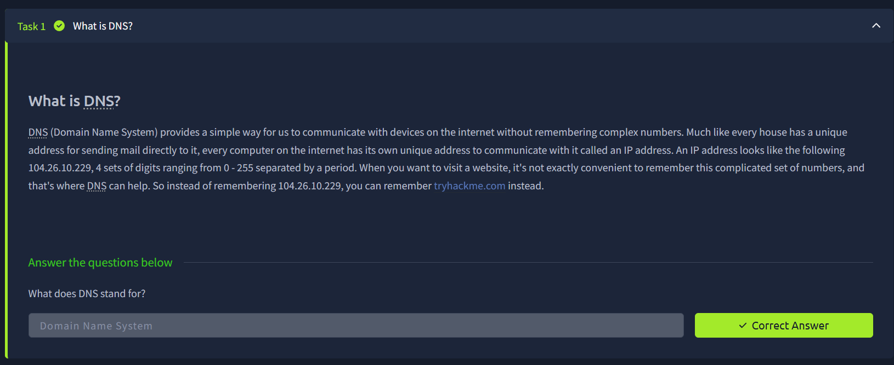

---

DNS provides a way to translate human-readable domain names into IP addresses.

👉 Example:

* `tryhackme.com` → `104.26.10.229`

### ✅ Answer:

`Domain Name System`

---

# Task 2: Domain Hierarchy

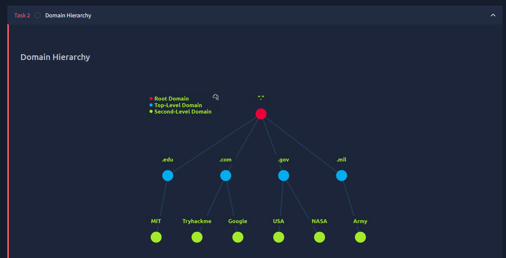
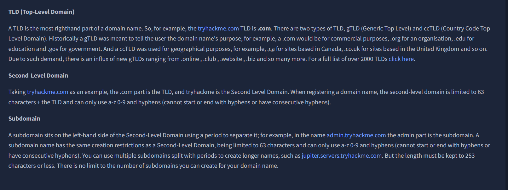

---

### 🔹 Structure:

* **TLD (Top-Level Domain):** `.com`, `.org`, `.in`
* **Second-Level Domain:** `tryhackme`
* **Subdomain:** `admin.tryhackme.com`

---

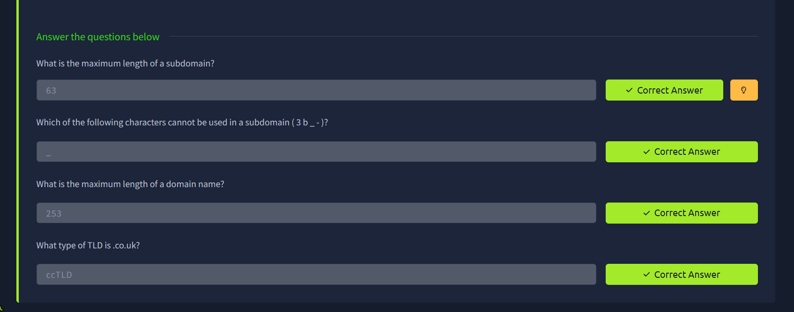

---

### ✅ Answers:

* Maximum subdomain length → `63`
* Invalid character → `_`
* Maximum domain length → `253`
* `.co.uk` type → `ccTLD`

---

# Task 3: DNS Record Types

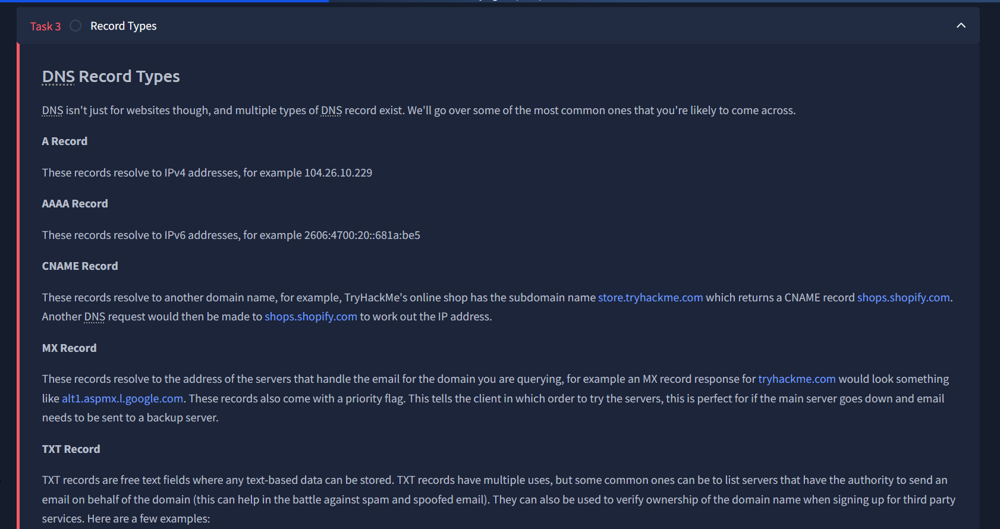

---

### 🔹 Common Records:

* **A Record:** Maps to IPv4
* **AAAA Record:** Maps to IPv6
* **CNAME Record:** Maps to another domain
* **MX Record:** Mail servers
* **TXT Record:** Text-based data

---

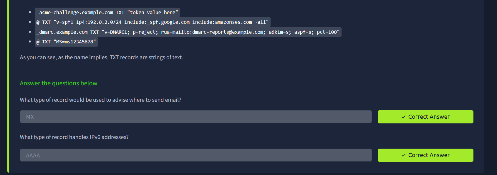

---

### ✅ Answers:

* Record for email → `MX`
* Record for IPv6 → `AAAA`

---

# Task 4: DNS Request Flow

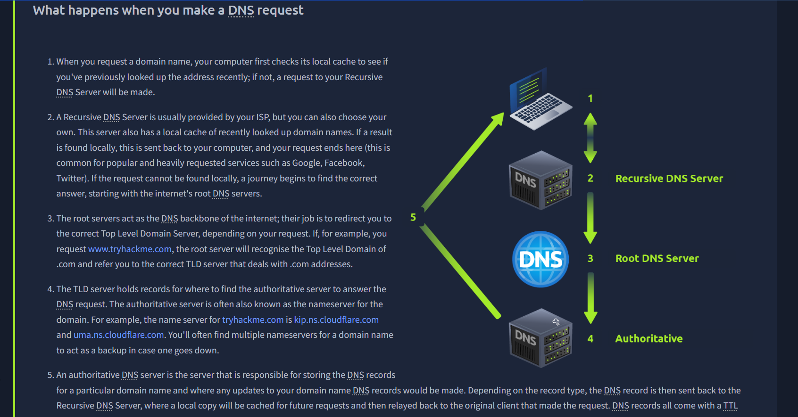

---

### Steps:

1. Local cache check
2. Recursive DNS server
3. Root server
4. TLD server
5. Authoritative server
6. Response returned + cached

---

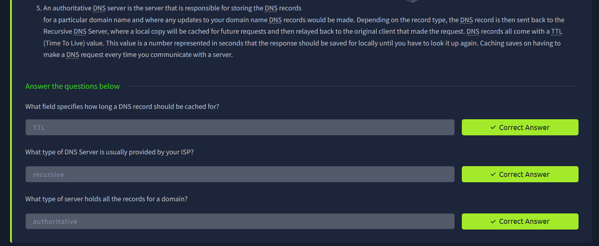

---

### ✅ Answers:

* Cache duration → `TTL`
* ISP provides → `Recursive DNS Server`
* Stores records → `Authoritative DNS Server`

---

# Task 5: Practical DNS Queries

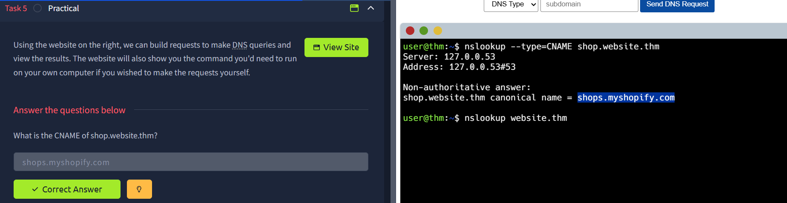

---

### 🔹 CNAME Record:

- Set the DNS query to CNAME
- Set the subdomain to shop

```bash
shops.myshopify.com
```

---

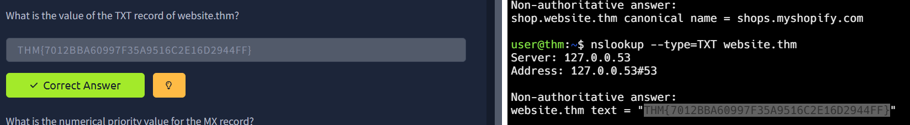

---

### 🔹 TXT Record:

- Set the DNS query to TXT
- Set the subdomain blank

```bash
THM{7012BBA60997F35A9516C2E16D2944FF}
```

---

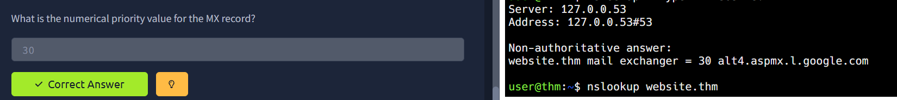

---

### 🔹 MX Priority:

- Set the DNS query to MX
- Set the subdomain blank

```bash
30
```

---

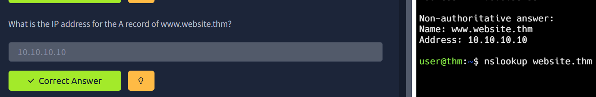

---

### 🔹 A Record IP:

- Set the DNS query to A
- Set the subdomain to www

```bash
10.10.10.10
```

---

# Final Outcome

Successfully understood:

* DNS structure
* Record types
* DNS resolution process
* Practical DNS queries

---

# Skills Gained

* DNS enumeration
* Understanding DNS hierarchy
* Identifying DNS records
* Basic reconnaissance skills

---

# Real-World Relevance

DNS is critical in:

* Penetration Testing
* Bug Bounty Hunting
* Network Security
* SOC Operations

---

# Challenges Faced

* Understanding DNS resolution flow
* Remembering record types

---


# Author

**Achal Deshmukh**

* 🎓 MCA Student
* 🔐 Cybersecurity Learner

---

# ⭐ Notes

DNS is a common attack surface in cybersecurity, often targeted for spoofing, phishing, and misconfiguration exploitation.
