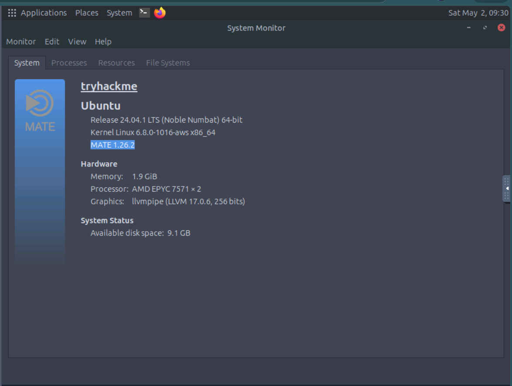
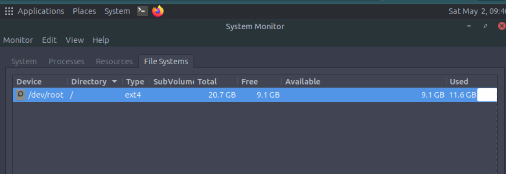
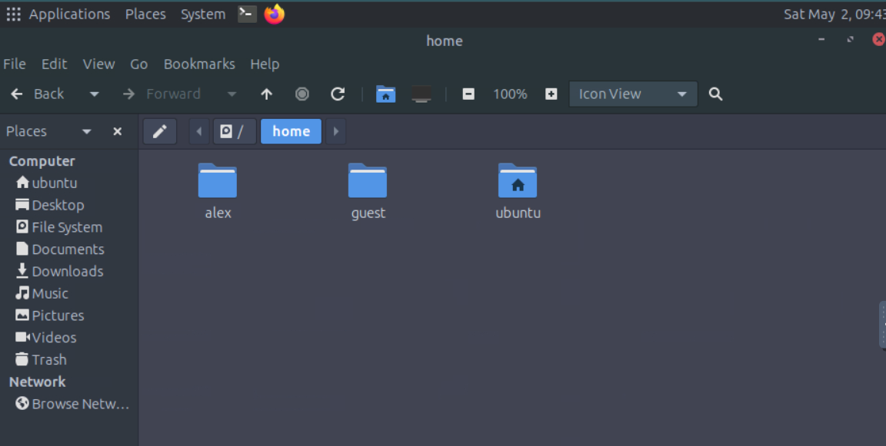
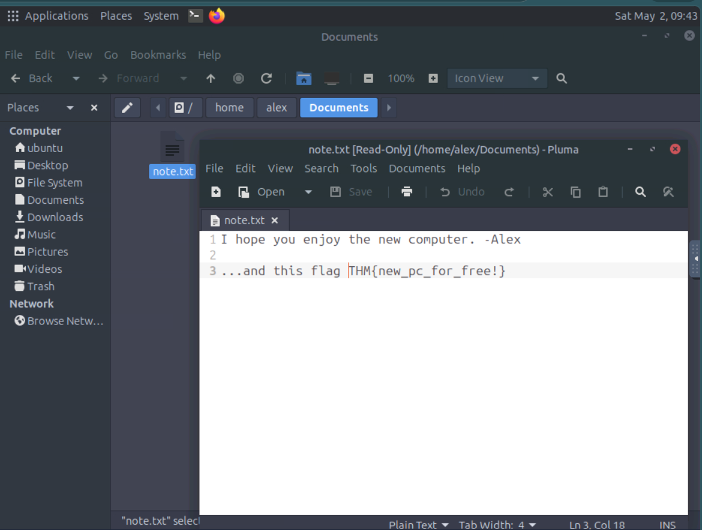

# Operating Systems Introduction – TryHackMe Write-up

## Room Information

Platform : TryHackMe 
Module : Operating System Fundamentals 
Room Name : Operating Systems Introduction 
Difficulty : Beginner 
Status : ✅ Completed 

---

# Objective

Learn about:

- What an Operating System (OS) is
- How an OS manages hardware and software
- Different types of operating systems
- GUI vs CLI interaction
- Basic system investigation in Linux

---

# Task 1: Introduction

## 🔹 Concept

Every device needs an Operating System (OS) to work properly.

The OS acts like a manager between:

- Hardware
- Applications
- Users

Without an OS:

- Apps cannot communicate with hardware
- Files cannot be managed
- Devices would conflict with each other

---

## 🔹 Learning Objectives

- Understand operating systems
- Learn OS responsibilities
- Explore OS types
- Practice system investigation

---

### ✅ Answer

No answer required

---

# Task 2: The Invisible Manager

## 🔹 What is an Operating System?

An Operating System (OS) is software that controls and manages all activities inside a computer.

### Examples

- Windows
- Linux
- macOS

---

# Airport Analogy

| Computer Part | Airport Example |
|---|---|
| Hardware | Runways and airplanes |
| Applications | Airlines and passengers |
| Operating System | Air traffic control |

The OS coordinates everything just like air traffic control manages airplanes.

---

# System Privilege Layers

Operating systems separate permissions into two areas.

---

## 🔹 Kernel Space

- Core protected area
- Has full hardware access
- Controls CPU, RAM, storage, and devices

---

## 🔹 User Space

- Normal applications run here
- Limited permissions
- Apps request services from the kernel

---

### ✅ Answer

**Hardware access area →** `Kernel Space`

---

# Operating System Responsibilities

## 🔹 Process Management

Manages running programs and CPU usage.

### Example

Running:

- Browser
- Music player
- Chat applications

all at the same time.

---

## 🔹 Memory Management

- Allocates RAM
- Protects memory between applications

---

## 🔹 File System Management

Handles:

- Files
- Folders
- Permissions
- Storage paths

---

## 🔹 User Management

Controls:

- User accounts
- Passwords
- Permissions

---

### ✅ Answer

**Manages users and permissions →** `User Management`

---

## 🔹 Device Management

Handles drivers and connected devices.

### Examples

- Mouse
- Printer
- USB devices

---

# Operating System Security

The OS also provides built-in security.

---

## 🔹 Security Features

| Feature | Purpose |
|---|---|
| Authentication | Verify user identity |
| Permissions | Control access |
| Isolation | Separate processes safely |
| System Protection | Protect critical files |

---

# Practical Investigation

Started the TryHackMe machine and opened:

```bash
About This Computer
```

Used the System Monitor to inspect system information.

---

## ✅ Answers



| Question | Answer |
|---|---|
| Ubuntu Mate version | `1.26.2` |
| Allocated memory | `1.9 GiB` |

---

# Task 3: OS Interaction and Landscape

# GUI vs CLI

Operating systems can be interacted with in two main ways.

---

## 🔹 GUI (Graphical User Interface)

Visual interaction using:

- Windows
- Icons
- Menus
- Mouse clicks

### Examples

- File Explorer
- Desktop

---

## 🔹 CLI (Command Line Interface)

Text-based interaction using commands.

### Examples

```bash
ls
cd
pwd
```

### CLI Provides

- More control
- Faster operations
- Precision

---

# Types of Operating Systems

| OS Type | Main Purpose |
|---|---|
| Desktop | Personal computing |
| Server | Hosting services |
| Mobile | Smartphones/tablets |
| Embedded | Small dedicated devices |
| Virtual/Cloud | Cloud systems and VMs |

---

# Desktop Operating Systems

## 🔹 Windows

- Most popular desktop OS
- Windows 10 / 11

---

## 🔹 macOS

Apple operating system.

### Examples

- Sonoma
- Sequoia

---

## 🔹 Linux

Open-source operating system family.

### Examples

- Ubuntu
- Debian
- Fedora

---

# Server Operating Systems

Used for:

- Web hosting
- Databases
- Cloud services

### Examples

- Ubuntu Server
- Red Hat
- Windows Server

---

# Mobile Operating Systems

## 🔹 Android

Most widely used mobile OS.

---

## 🔹 iOS

Apple mobile operating system.

---

# Embedded & IoT Operating Systems

Used in:

- Routers
- Smart TVs
- IoT devices
- Appliances

### Examples

- OpenWrt
- Ubuntu Core
- FreeRTOS

---

# Virtual & Cloud Operating Systems

Used in:

- Cloud infrastructure
- Containers
- Virtual machines

### Examples

- Amazon Linux
- Alpine Linux
- Rocky Linux

---

# Continuing the Investigation

Explored the Linux file system and user directories.

---

## ✅ Answers




| Question | Answer |
|---|---|
| File system type for `/dev/root` | `ext4` |
| Number of user directories | `3` |

---

# Finding the Flag



Navigated to:

```bash
/home/alex/Documents/note.txt
```

---

## ✅ Flag

```bash
THM{new_pc_for_free!}
```

---

# Task 4: Conclusion

## 🔹 What I Learned

- What an OS is
- Kernel vs User Space
- OS responsibilities
- GUI and CLI basics
- Different operating systems
- Linux system investigation

---

# Key Terminology

| Term | Meaning |
|---|---|
| Operating System | Software managing hardware/resources |
| Kernel Space | Protected hardware access area |
| User Space | Safe area for applications |
| GUI | Visual interaction |
| CLI | Command-based interaction |

---

# Skills Gained

- Understanding operating systems
- Linux system investigation
- GUI and CLI basics
- File system understanding
- User management concepts

---

# Real-World Relevance

Useful for:

- Cybersecurity
- Linux administration
- System management
- Ethical hacking
- Cloud computing

---

# Challenges Faced

- Understanding kernel vs user space
- Learning different OS categories
- Understanding CLI usage

---

# Author

## Achal Deshmukh

- 🎓 MCA Student
- 🔐 Cybersecurity Learner
- 💻 TryHackMe Enthusiast

---

# ⭐ Notes

Operating systems are the foundation of every computer system. Understanding how they manage hardware, users, files, and security is an important first step toward cybersecurity and ethical hacking.

---
