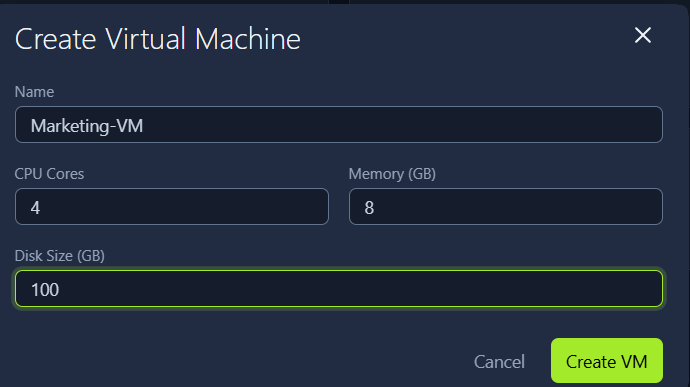
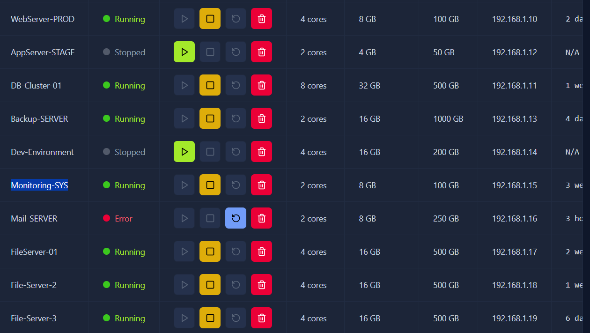
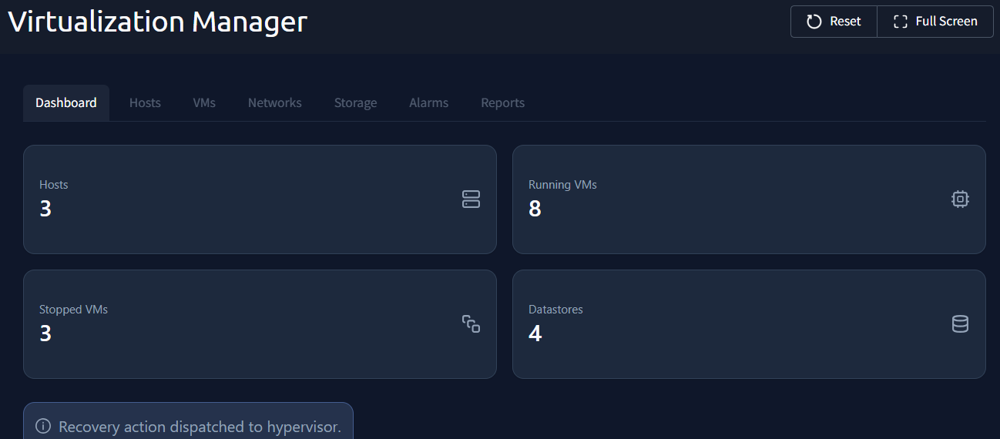

# Virtualisation Basics

## Introduction

In this room, I learned the fundamentals of virtualization and how it powers modern IT infrastructure by improving hardware efficiency, scalability, and isolation.

Before virtualization, companies usually followed the rule:

```text
One Server = One Application
```

This approach caused:
- High hardware costs
- Poor resource utilization
- Slow deployment
- Difficult scaling

Virtualization solved these problems by allowing multiple virtual systems to run safely on one physical machine.

---

# Learning Objectives

After completing this room, I learned about:

- Why virtualization is important
- Problems with physical servers
- Hypervisors
- Virtual Machines (VMs)
- Containers
- Virtualization management
- Hardware utilization
- Resource isolation

---

# Task 1 — Introduction

## What I Learned

Virtualization helps companies:
- Reduce hardware costs
- Improve resource usage
- Build scalable systems
- Run multiple applications efficiently

Instead of buying one physical server for every application, virtualization allows several virtual systems to share the same hardware safely.

---

# Task 2 — Virtualization Overview

# Traditional Physical Server Problems

Earlier, businesses deployed applications using separate physical servers.

Example:
- One server for website
- One server for database
- One server for email
- One server for internal applications

This created many issues.

---

# Problems with Physical Servers

## High Cost

Companies had to pay for:
- Hardware
- Electricity
- Cooling
- Maintenance
- Data center space

---

## Low Utilization

Most servers only used:
```text
5% – 20%
```

of their total capacity.

This wasted:
- CPU
- RAM
- Storage

---

## Slow Deployment

Setting up new physical servers could take:
- Days
- Weeks

---

## Difficult Scaling

More traffic often required purchasing new hardware.

---

# What is Virtualization?

Virtualization allows:
```text
Multiple applications to share one physical server safely
```

This is achieved using a:
```text
Hypervisor
```

---

# Building Analogy

The room used a building analogy to explain virtualization.

| Real World | Virtualization |
|---|---|
| Building | Physical Server |
| Apartments | Virtual Machines |
| Tenants | Applications/Operating Systems |
| Building Manager | Hypervisor |

The hypervisor safely divides hardware resources between virtual machines.

---

# Virtual Machines (VMs)

A VM acts like a real computer:
- Has CPU
- Has RAM
- Has Storage
- Has Networking
- Runs its own operating system

Each VM is isolated from others.

If one VM crashes:
```text
Other VMs continue working
```

---

# Task 2 Questions & Answers

## Q1. What does virtualization enable multiple applications to share?

```text
physical server
```

---

## Q2. What software manages virtual machine resources?

```text
hypervisor
```

---

# Task 3 — Virtualization Components

# Hypervisor

A hypervisor is the main software behind virtualization.

It:
- Creates VMs
- Allocates resources
- Manages VM lifecycle
- Keeps systems isolated

---

# Hypervisor Types

---

# Type 1 Hypervisor

Runs directly on hardware.

### Advantages
- Fast
- Efficient
- Enterprise-grade

### Used For
- Data centers
- Production servers
- Enterprise virtualization

---

# Type 2 Hypervisor

Runs inside an operating system.

### Advantages
- Easy to install
- Good for learning/testing

### Used For
- Home labs
- Kali Linux labs
- Malware analysis
- Software testing

---

# Examples of Type 2 Hypervisors

- Oracle VirtualBox
- VMware Workstation

---

# Virtual Machines

A VM is a complete virtual computer.

It includes:
- Virtual CPU
- Virtual RAM
- Virtual Storage
- Virtual Network Adapter

Each VM can run:
- Windows
- Linux
- Kali Linux
- Other operating systems

---

# Real-World VM Use Cases

## Cybersecurity Practice

Run Kali Linux safely inside a VM.

---

## Malware Analysis

Test malicious files in isolated systems.

---

# Containers

Containers are lightweight isolated environments.

Unlike VMs:
- Containers share the host OS kernel
- Use fewer resources
- Start very quickly

---

# Container Characteristics

Containers:
- Package applications and dependencies
- Remain isolated
- Deploy consistently
- Scale efficiently

---

# Docker

Docker is the most popular container platform.

It simplifies:
- Building containers
- Running containers
- Deploying applications

---

# VM vs Container

| Virtual Machine | Container |
|---|---|
| Full operating system | Shares host OS |
| More resource usage | Lightweight |
| Slower startup | Fast startup |
| Better isolation | Better efficiency |

---

# Task 3 Questions & Answers

## Q1. Which hypervisor type is best for a study lab?

```text
type 2
```

---

## Q2. What should companies use to run multiple apps in one VM?

```text
containers
```

---

# Task 4 — Managing Virtual Machines

In this exercise, I managed a virtual environment for a fictional company called:

```text
AutoGalo
```

The environment used a virtualization management platform.

---

# Virtualization Manager Sections

The dashboard contained:

| Section | Purpose |
|---|---|
| Summary | Overall environment status |
| Virtual Machines | VM management |
| Hosts | Physical server monitoring |

---

# Investigating Mail Server Issue

The:
```text
Mail-SERVER
```

VM was in an:
```text
Error
```

state.

---

# Fix Applied

I restarted the VM using the:
```text
Blue Square Restart Button
```

After restarting:
- The VM returned to normal
- Email service resumed working

---

# Creating a New Virtual Machine

I created a VM for the marketing team.

---

# VM Configuration

| Setting | Value |
|---|---|
| Name | Marketing-VM |
| CPU Cores | 4 |
| Memory | 8 GB |
| Disk Size | 100 GB |

After creation:
```text
Marketing-VM
```

appeared in the VM list.

---

# Host Analysis

I analyzed physical server usage.

---

# Findings

## HV-PROD-01
- Had available resources
- Could host more VMs

---

## HV-PROD-02
- Nearly 100% utilized
- Required reporting

---

## HV-BACKUP-01
- Disconnected
- Hosting no VMs

---

# Task 4 Questions & Answers

## Q1. VM running the longest?



```text
Monitoring-SYS
```

---

## Q2. VM using the most memory?



```text
DB-Cluster-01
```

---

## Q3. Running VMs after fixing Mail-SERVER?


```text
8
```

---

## Q4. Physical host running most VMs?



```text
HV-PROD-02
```

---

# Task 5 — Conclusion

# Key Terminology

---

# Virtualization

Allows one physical computer to behave like multiple computers.

---

# Hypervisor

Software that creates and manages virtual machines.

---

# Virtual Machine (VM)

A complete virtual computer with its own operating system.

---

# Container

A lightweight isolated application environment.

---

# Container Image

A template used to create containers.

---

# Network Ports

Communication endpoints used by applications.

---

# Benefits of Virtualization

- Cost savings
- Better resource usage
- Safe cybersecurity testing
- Faster deployment
- Flexibility
- Portability
- Scalability
- Centralized management

---

# Final Key Takeaways

- Virtualization maximizes hardware efficiency
- Hypervisors manage virtual machines safely
- VMs provide strong isolation
- Containers are lightweight and scalable
- Virtualization is the foundation of cloud computing
- Docker simplifies container deployment
- Virtualization is essential in cybersecurity labs

---

# Skills Practiced

- Virtualization Fundamentals
- Hypervisor Basics
- Virtual Machine Management
- Container Concepts
- Docker Basics
- Resource Allocation
- Infrastructure Monitoring
- Cybersecurity Lab Setup
