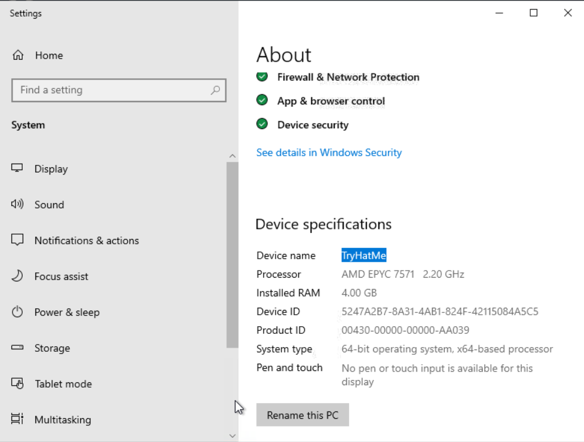
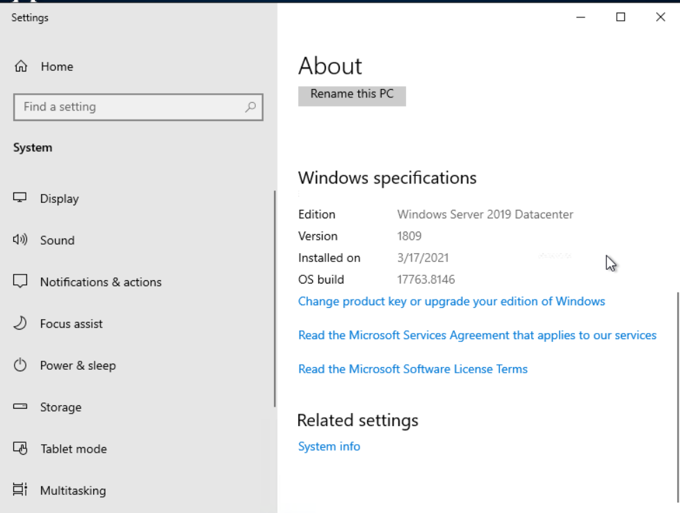
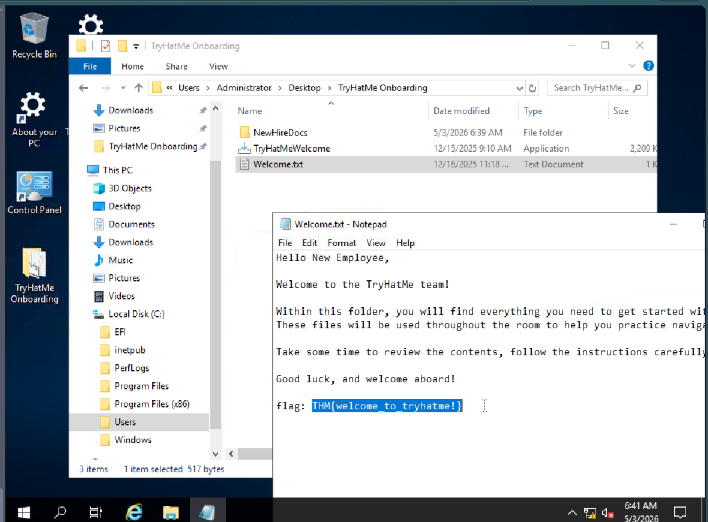
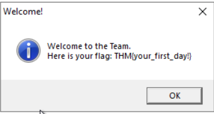
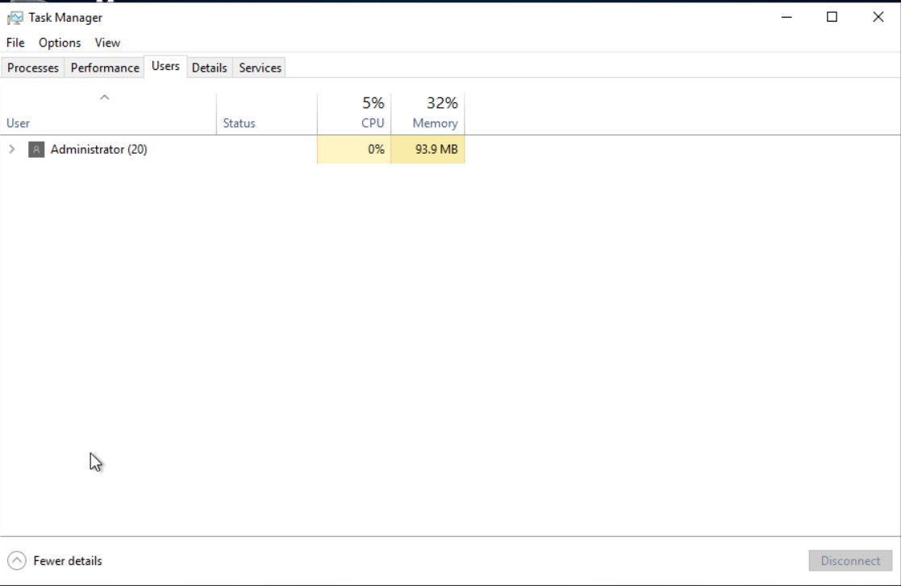
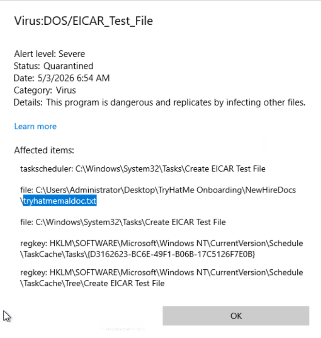
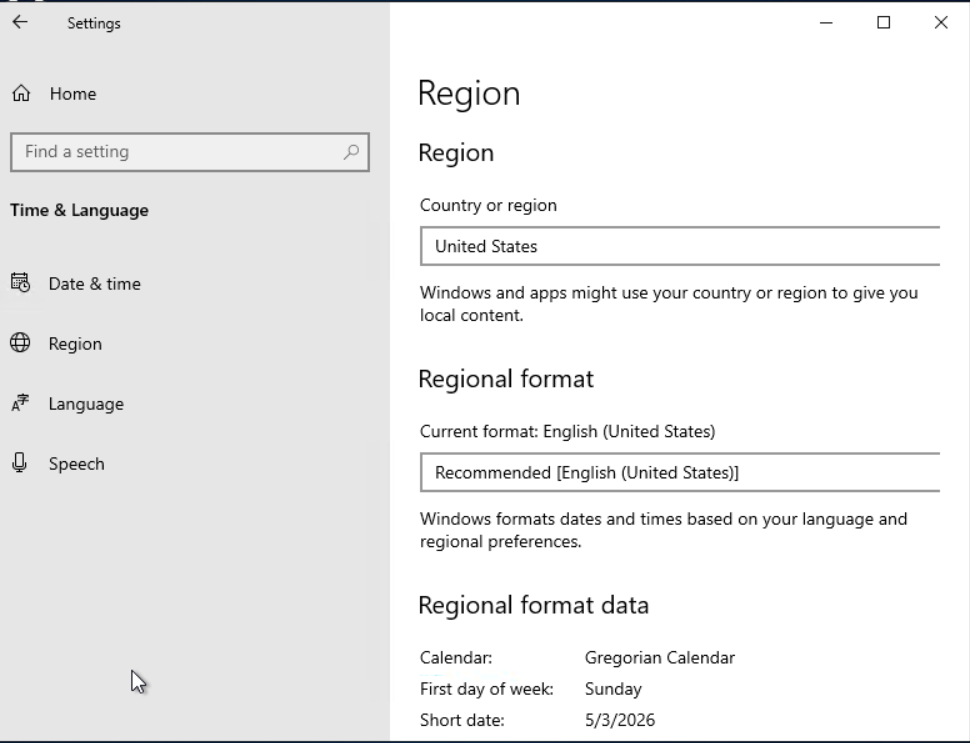

# Windows Basics – TryHackMe Write-up

## Room Information

* **Platform:** TryHackMe
* **Module:** Operating System Fundamentals
* **Room Name:** Windows Basics
* **Difficulty:** Beginner
* **Status:** ✅ Completed

---

# Objective

Learn about:

* Windows operating system basics
* Navigating the Windows interface
* Managing files and folders
* Using Windows Settings and Task Manager
* Basic Windows security tools

---

# Task 1: Introduction

## 🔹 Concept

Windows is one of the most widely used operating systems in the world.

In this room, we acted as a new employee at **TryHatMe** and learned how to use a Windows workstation.

---

## 🔹 Learning Objectives

* Navigate the Windows Desktop
* Use File Explorer
* Manage files and folders
* Explore Windows Settings
* Use Task Manager
* Understand Windows Security basics

---

## ✅ Answer

* No answer required

---

# Task 2: Exploring the Windows Workspace

## 🔹 Evolution of Windows

Microsoft Windows evolved from:

* MS-DOS (command-line only)
* Windows 1.0
* Modern Windows versions like Windows 10/11 and Server editions

---

# Logging In and Authentication

Before accessing Windows, users must authenticate themselves.

---

## 🔹 Windows Account Types

| Account Type | Purpose |
| --- | --- |
| Guest | Temporary restricted access |
| Standard User | Daily tasks with limited permissions |
| Administrator | Full system access |

---

## 🔹 In This Lab

We were automatically logged in as:

```bash
Administrator
```

This allowed full access to system settings and applications.

---

# Understanding the Windows Desktop

The Windows Desktop is the main workspace.

---

## 🔹 Main Components

### Desktop

Contains:

* Files
* Folders
* Shortcuts

---

### Taskbar

Provides access to:

* Applications
* Search
* Notifications
* System settings

---

## 🔹 Important Desktop Features

| Feature | Purpose |
| --- | --- |
| Desktop Icons | Quick shortcuts |
| Start Menu | Access apps and settings |
| Search | Find files/apps quickly |
| Task View | Switch between windows |
| Pinned Apps | Quick access tools |
| Notifications | Alerts and settings |

---

# Start Menu

The Start Menu is the central access point in Windows.

Used for:

* Opening apps
* Accessing settings
* Restarting/shutting down PC

---

# Built-in Windows Applications

Windows includes useful built-in tools.

---

## 🔹 Common Tools

| Tool | Purpose |
| --- | --- |
| Notepad | Edit text files |
| Paint | Basic drawing |
| Calculator | Calculations |
| File Explorer | Browse files |

---

# Getting System Information

Opened:

```bash
About your PC
```

This section shows:

* Device specifications
* Windows version
* Installed RAM
* Security information

---

## ✅ Answers




| Question | Answer |
| --- | --- |
| Device name | `TryHatMe` |
| Installed RAM | `4.00 GB` |
| Windows Server version | `1809` |

---

# File Exploration and Management

Windows organizes files using folders and subfolders.

---

## 🔹 File Explorer

Used to:

* Open folders
* Manage files
* Search files
* View file paths

---

## 🔹 Example Path

```bash
C:\Users\Administrator\Desktop\TryHatMe Onboarding
```

---

# Onboarding Folder Investigation

Explored the:

```bash
TryHatMe Onboarding
```

folder located on the Desktop.

---

## ✅ Flag Found



Inside:

```bash
Welcome.txt
```

Flag:

```bash
THM{welcome_to_tryhatme!}
```

---

# Task 3: Configuring and Securing Windows

Applications are programs used for different tasks in Windows.

---

# Updating Applications

Keeping applications updated helps improve:

* Security
* Stability
* Performance

---

## 🔹 Windows Update

Used for:

* Updating Windows OS
* Installing security patches
* Updating built-in tools

---

# Installing Applications

Applications can be installed using:

| Method | Description |
| --- | --- |
| Microsoft Store | Safe app installation |
| Internet Installer | Download `.exe` or `.msi` files |

---

# Hands-On Installation

Ran installer:

```bash
TryHatMeWelcome
```

from the onboarding folder.

---

## ✅ Flag After Installation



```bash
THM{your_first_day!}
```

---

# Uninstalling Applications

Programs can be removed using:

* Add or Remove Programs
* Control Panel
* Application uninstallers

---

# Windows Settings vs Control Panel

## 🔹 Windows Settings

Modern settings interface for:

* Personalization
* Devices
* Security
* Accounts

---

## 🔹 Control Panel

Legacy interface for advanced system configurations.

---

# Task Manager

Task Manager monitors system activity.

Opened using the Desktop shortcut.

---

## 🔹 Important Tabs

| Tab | Purpose |
| --- | --- |
| Processes | Running apps/processes |
| Performance | CPU/RAM usage |
| Users | Logged-in users |
| Details | Advanced process info |
| Services | Running Windows services |

---

## ✅ Answer



Currently logged-in user:

```bash
Administrator
```

---

# Windows Security

Windows includes built-in security protections.

---

# 🔹 Main Security Areas

| Security Feature | Purpose |
| --- | --- |
| Virus & Threat Protection | Malware scanning |
| Firewall & Network Protection | Block unauthorized traffic |
| App & Browser Control | Protect from unsafe apps |
| Device Security | Hardware protection |

---

# Custom Security Scan

Performed a custom scan on:

```bash
TryHatMe Onboarding
```

folder.

Windows detected a safe test malware file.

---

## ✅ Answer



Affected file:

```bash
tryhatmemaldoc.txt
```

---

# Time & Language Settings

Explored:

```bash
Time & Language
```

settings in Windows.

---

## ✅ Answer



Current region:

```bash
United States
```

---

# Windows Defender Firewall

Windows Defender Firewall helps protect the system from unauthorized network access.

---

## 🔹 Firewall Profiles

| Profile | Usage |
| --- | --- |
| Domain | Organization network |
| Private | Trusted network |
| Public | Public/untrusted network |

---

# Task 4: Conclusion

## 🔹 What I Learned

* Windows desktop navigation
* File and folder management
* Windows Settings and Control Panel
* Installing applications
* Using Task Manager
* Windows Security basics
* Firewall concepts

---

# Key Terminology

| Term | Meaning |
| --- | --- |
| Desktop | Main Windows workspace |
| Taskbar | Quick-access application bar |
| Start Menu | Main app launcher |
| File Explorer | File management tool |
| Task Manager | System monitoring tool |
| Windows Security | Built-in security dashboard |
| Windows Defender Firewall | Network protection tool |

---

# Skills Gained

* Windows navigation
* File management
* Application installation
* System monitoring
* Basic security management

---

# Real-World Relevance

Useful for:

* Cybersecurity
* Windows administration
* Helpdesk support
* Ethical hacking
* System troubleshooting

---

# Challenges Faced

* Understanding Windows security sections
* Learning Task Manager tabs
* Exploring advanced settings

---

# Author

**Achal Deshmukh**

* 🎓 MCA Student
* 🔐 Cybersecurity Learner
* 💻 TryHackMe Enthusiast

---

# ⭐ Notes

Windows is one of the most important operating systems to learn for cybersecurity and IT careers. Understanding its interface, tools, and security features builds a strong foundation for future learning in ethical hacking, system administration, and digital security.
