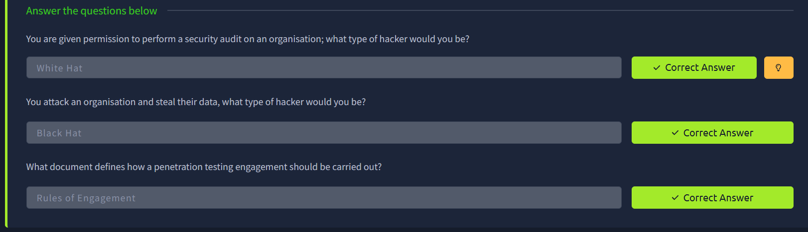
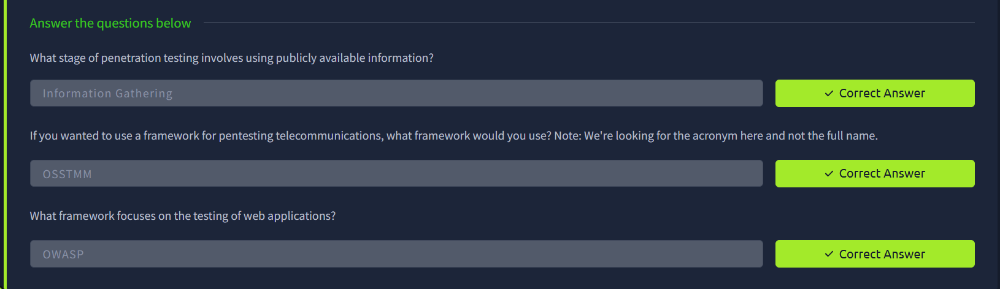
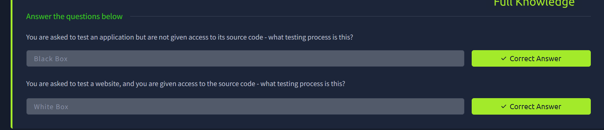
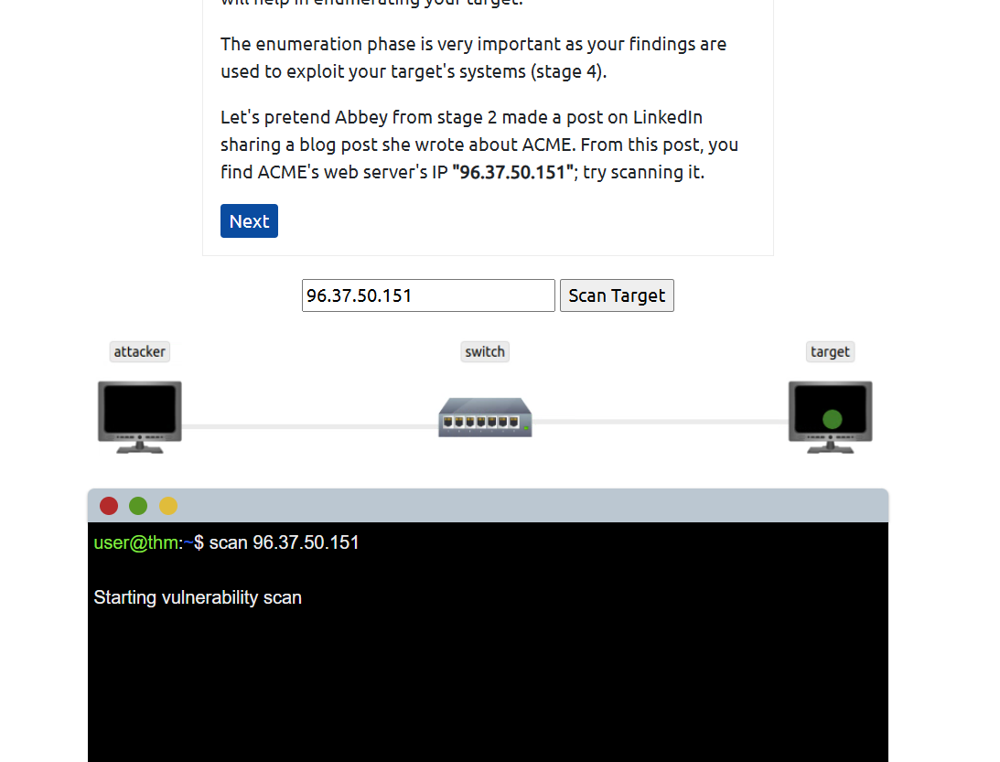
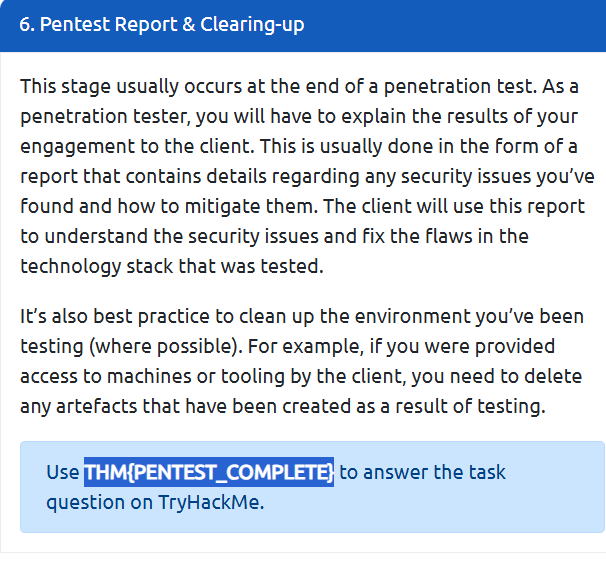

# Pentesting Fundamentals – TryHackMe Write-up

## Room Information

* **Platform:** TryHackMe
* **Path:** Jr Penetration Tester
* **Room Name:** Pentesting Fundamentals
* **Status:** ✅ Completed

---

## Objective

Learn:

* What penetration testing is
* Ethics and legality
* Methodologies
* Types of testing

---

# Task 1: What is Penetration Testing?

### 🔹 Definition:

Penetration Testing (Pentest) is:

> An **authorized security test** to find vulnerabilities in systems.

* Uses real hacker techniques
* Helps organisations stay secure

---

### Fact:

* 2200+ cyber attacks daily

---

### ✅ Answer:

* No answer required

---

# Task 2: Ethics & Legality

### 🔹 Key Concepts:

* Pentesting must be **authorized**
* Everything is defined in agreement

---

### 🔹 Types of Hackers:

* **White Hat:** Ethical (legal)
* **Grey Hat:** Mixed
* **Black Hat:** Malicious

---

### 🔹 Rules of Engagement (ROE):

Defines:

* Permission
* Scope
* Rules

---



### ✅ Answers:

* Authorized tester → `White Hat`
* Malicious attacker → `Black Hat`
* Document → `Rules of Engagement`

---

# Task 3: Methodologies

### 🔹 Pentesting Stages:

1. Information Gathering
2. Scanning / Enumeration
3. Exploitation
4. Privilege Escalation
5. Post-Exploitation

---

### 🔹 Frameworks:

* **OSSTMM** → Telecom & networks
* **OWASP** → Web apps
* **NIST** → Security standards
* **NCSC CAF** → Risk assessment

---



### ✅ Answers:

* Public info stage → `Information Gathering`
* Telecom framework → `OSSTMM`
* Web framework → `OWASP`

---

# Task 4: Testing Types

### 🔹 Black Box:

* No knowledge of system

### 🔹 Grey Box:

* Partial knowledge

### 🔹 White Box:

* Full access (source code)

---



### ✅ Answers:

* No source code → `Black Box`
* Full access → `White Box`

---

# Task 5: Practical (ACME Pentest)

### 🔹 Activity:

Performed a simulated penetration test on ACME infrastructure.

---



---



### ✅ Flag:

```bash
THM{PENTEST_COMPLETE}
```

---

# Final Outcome

Learned:

* Basics of penetration testing
* Legal and ethical considerations
* Real-world testing process

---

# Skills Gained

* Security mindset
* Understanding attack lifecycle
* Knowledge of frameworks

---

# Real-World Relevance

Important for:

* Ethical Hacking
* Bug Bounty
* Security Testing

---

# Challenges Faced

* Understanding methodologies
* Differentiating testing types

---

# 🚀 Author

**Achal Deshmukh**

* 🎓 MCA Student
* 🔐 Cybersecurity Learner

---

# ⭐ Notes

This room builds the foundation for becoming a penetration tester and understanding real-world security testing workflows.
